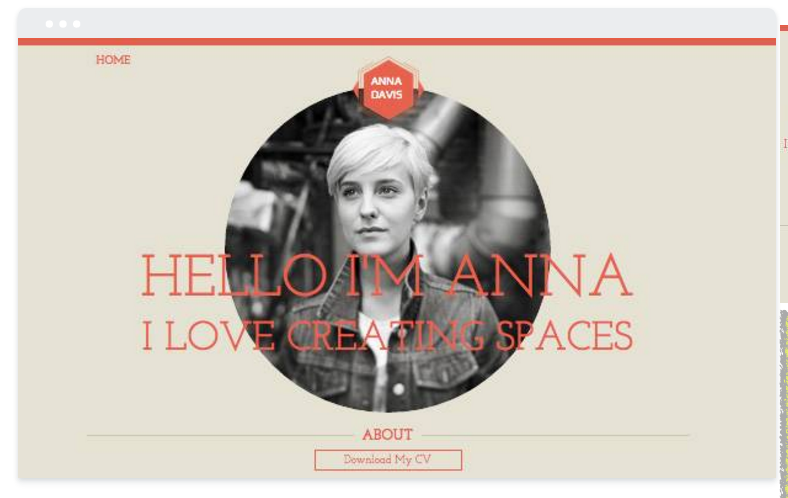
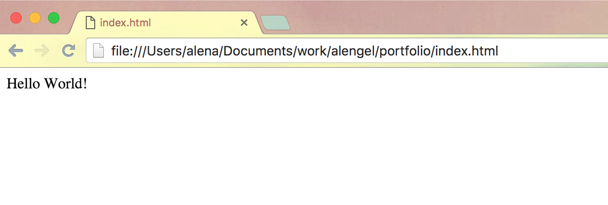
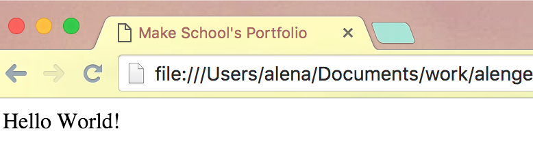

#Get started with HTML, CSS and JavaScript
Most developers have a blog or a portfolio where they can showcase their work and attract potential employers. It’s of course possible to use one of the many templates that are available for free or a fee but the templates you find might not be what you want exactly but you’ll have to accept it or…

Make your own portfolio from scratch! It’s not that very hard and will teach you HTML, CSS and JavaScript. This tutorial assumes that you have no experience but is also aimed at people who already have written in those three languages and will add some advanced concepts. We will make our portfolio mobile friendly with advanced CSS3 concepts and give it a cool looking gallery using a neat mobile friendly JavaScript plugin. 

At the end of our tutorial, we will put our newly created website live to Github, so we’ll also get to cover version control a bit.

Our complete portfolio will look like this on desktop & mobile:



Alright, let’s get started. We will use the popular text editor Sublime Text 3 to create our files and the Chrome browser to inspect our files and run the portfolio.

You can use any text editor you feel comfortable with, for example the Atom editor, WebStorm or just your simple old NotePad or TextEdit. It really depends on your own preference and what you want from your text editor.

Let’s start by making a folder on your computer and name it **portfolio**. Inside it, let’s create an HTML file and name it **index.html**. Depending on your text editor, specifying a file with .html will color the syntax while you’re writing the code, which makes it easier to read and work with.

> [info]
> To boilerplate or not to boilerplate?
> ...

Let’s create the basic outline of an HTML file. An HTML file consists of HTML tags and needs at least the following:

```
<html>
    <head>
        ...
    </head>

    <body>
        Hello World!
    </body>
</html>
```

These simple tags are enough to display our well known *Hello World* in the browser. 

> [action]
> Save your file and open the index.html file in the browser to make sure that everything worked as expected.

You should see something like this:



Do you spot the index.html title in the tab of the browser? Let's change that to something more appropriate like "MakeSchool's Portfolio" - you should change this to something that reflects your name, username or anything else that you want to showcase.

We can do this by adding the `<title>` tag to the `<head>` tag, which is responsible for the name of your website.

```
<head>
    <title>Make School's Portfolio</title>
</head>
```



Ok, now let's get started in earnest. We want to put some information on the portfolio that shows who we are and what work we have done, so we need to add some information about us.

#Adding the HTML
There are some great new HTML5 additions, that make adding components to a web site quite self explanatory. Here are a few tags that can be used to add components:

- **<article>**  Represents an independent piece of content of a document, such as a blog entry or newspaper article.
- **<audio>**  Defines an audio file.
- **<footer>**  Represents a footer for a section and can contain information about the author, copyright information, et cetera.
- **<header>**  Represents a group of introductory or navigational aids.
- **<nav>**  Represents a section of the document intended for navigation.
- **<section>**  Represents a generic document or application section.

Some of the tags from HTML versions before that are also great to know are the following tags:

- **<button>**  Represents a clickable button.
- **<div>**  Is the generic container for flow content, which does not inherently represent anything. It can be used to group elements for styling purposes or because they share attribute values. It should be used only when no other semantic element (such as <article> or <nav>) is appropriate.
- **<h1> ... <h6>**  Heading elements implement six levels of document headings, <h1> is the most important and <h6> is the least. A heading element briefly describes the topic of the section it introduces.
- ****  Represents an image in the document. It is a self closing tag and has no closing tag. Note the backslash.
- **<li>**  Is used to represent an item in a list. It must be contained in a parent element: an ordered list (<ol>), an unordered list (<ul>), or a menu (<menu>).
- **<ol>**  Represents an ordered list of items. Typically, ordered-list items are displayed with a preceding numbering, which can be of any form, like numerals, letters or Romans numerals or even simple bullets.
- **<p>**  Represents a paragraph of text.
- **<span>**  Is a generic inline container for phrasing content, which does not inherently represent anything. It can be used to group elements for styling purposes for example.
- **<ul>**  Represents an unordered list of items, namely a collection of items that do not have a numerical ordering, and their order in the list is meaningless. 

> [action]
> Look at the picture above and think about which HTML tags should be used to add the content on the page. Don't worry about the styling for now, just get all the content on the page for now.

It would be easiest to think of the website in sections. The top section of the page will contain the navigation to other pages. 

> [solution]
> The top section should contain a header tag and a nav tag, with an unordered list and the appropriate link tags, like so:
>
>    <header>
>      <nav>
>          <ul>
>              <li><a href="#">Home</a></li>
>              <li><a href="#">Gallery</a></li>
>              <li><a href="#">Contact</a></li>
>          </ul>
>      </nav>
>    </header>

Before adding the middle section, let's focus on the bottom as it has only two additions to the page. The bottom section will contain the title for the bottom section and the "Download My CV" button.

> [solution]
> The bottom section should contain the footer tag and within it, the title of the section as well as the button to download the CV.
>
>    <footer>
>        <h3>About</h3>
>        <button>Download My CV</button>
>    </footer>

The middle section contains our head image, a logo and a couple of catchy phrases that bring attention to the page. 

> [solution]
> Our head image and our logo should of course be in  tags. The two phrases could be in h1 and h2 tags to achieve a hierarchy of the two phrases.
>
>    <section>
>        
>        
>        <h1>Hello I'm Kitty</h1>
>        <h2>I love creating code</h2>
>    </section>


> [action]
> When you have finished adding your content to the page, refresh the browser and make sure all your content shows up. 


Now that we have all of our content there, you can see that it is in dire need of some styling. We want to make sure that our styling looks good on mobile as well as desktop, so we will style it with resizability in mind.

> [solution]
> The entire HTML file should look like this now:
>
>    <html>
>        <head>
>            <title>Make School's Portfolio</title>
>        </head>
>    
>        <body>
>            <header>
>                <nav>
>                    <ul>
>                        <li><a href="#">Home</a></li>
>                        <li><a href="#">Gallery</a></li>
>                        <li><a href="#">Contact</a></li>
>                    </ul>
>                </nav>
>            </header>
>    
>            <section>
>                
>                
>                <h1>Hello I'm Kitty</h1>
>                <h2>I love creating code</h2>
>            </section>
>    
>            <footer>
>                <h3>About</h3>
>                <button>Download My CV</button>
>            </footer>
>        </body>
>    </html>
>    