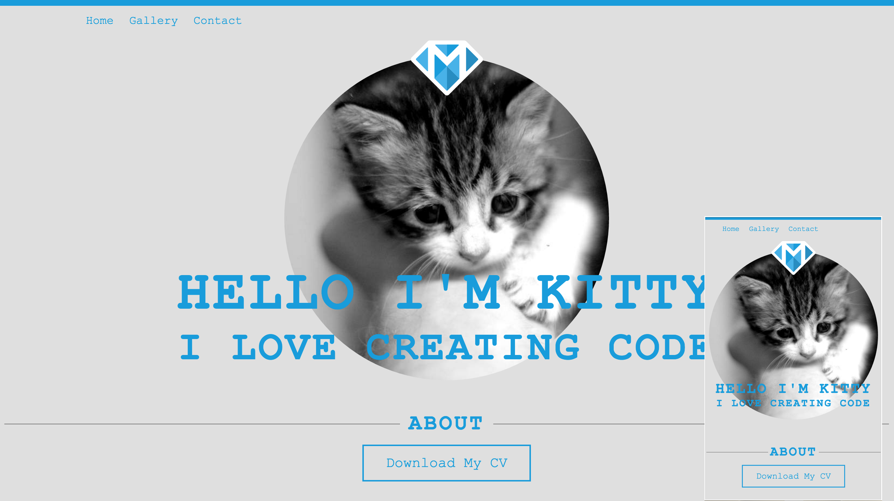

#Building Your Own Portfolio
Most developers or artists have a blog or a portfolio where they can showcase their work and attract potential employers. It is of course possible to use one of the many templates that are available for free or a fee but the templates you find might not be what you want exactly but you will have to accept it or…

Make your own portfolio from scratch! It is not that very hard and will teach you HTML, CSS and JavaScript skills. This tutorial assumes that you have no experience but is also aimed at people who already have written in those three languages and will add some advanced concepts. We will make our portfolio mobile friendly with advanced CSS3 concepts and give it a cool looking gallery using a neat mobile friendly JavaScript plugin. 

At the end of our tutorial, we will put our newly created website live to Github, so we will also get to cover version control and publishing a bit.

Our complete portfolio will look like this on desktop & mobile:



You can also see a full working version at http://kitty-makeschool.github.io - go ahead and play with it to see what we will achieve by the end of the tutorial.

#Languages We'll Use
We are going to use HTML, CSS and JavaScript to create this site and then host it on Github Pages, which will allow other people to access the site. 

##What is HTML?
HTML stands for **HyperText Markup Language**. Developed by scientist Tim Berners-Lee in 1990, HTML is the "hidden" code that helps us communicate with others on the World Wide Web (WWW).
When writing HTML, you add "tags" to the text in order to create the structure. These tags tell the browser how to display the text or graphics in the document.

HTML tags have a start tag and an end tag. The p tag (p = paragraph) would look like this:
```
<p>A paragraph is contained inside the p tags.</p>
```
With the exception of a few tags, most HTML tags follow this rule. The image tag `` is one of the few tags that don't follow this convention as they are considered empty tags. But more to this later on!

##What is CSS?
CSS stands for **Cascading Style Sheets** and it’s a language which helps us change the way our HTML page looks. If you apply two rules of the same property to one element, the last rule will take precedence over any rules that were declared before in the stylesheet. This is because browsers read stylesheets top to bottom, thus cascading over any rules that were declared for an element.

##What is JavaScript?
JavaScript is a cross-platform, object-oriented scripting language, the ingredient that makes the Web awesome, your favorite sites interactive, and online games fun. JavaScript contains a standard library of objects, such as Array, Date, and Math, and a core set of language elements such as operators, control structures, and statements. We'll show you how to use it on your portfolio effectively. 

#Things You'll Learn in this Tutorial 
At the end of the tutorial, you will have learnt 

- How to create HTML pages
- Link the pages together
- Use cutting edge CSS3 to make the pages responsive
- Understand basic JavaScript
- Learn how to use JavaScript plugins to create an image gallery
- Host your portfolio on Github and make it accessible to the public

So, let's get started!