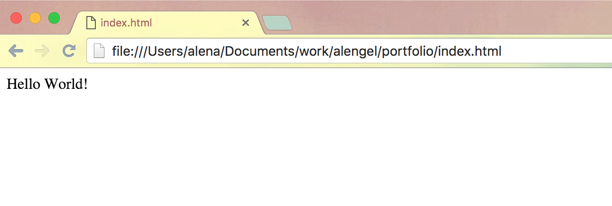
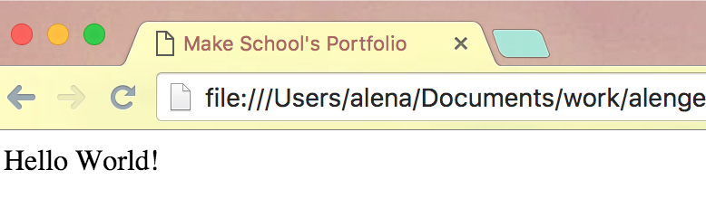
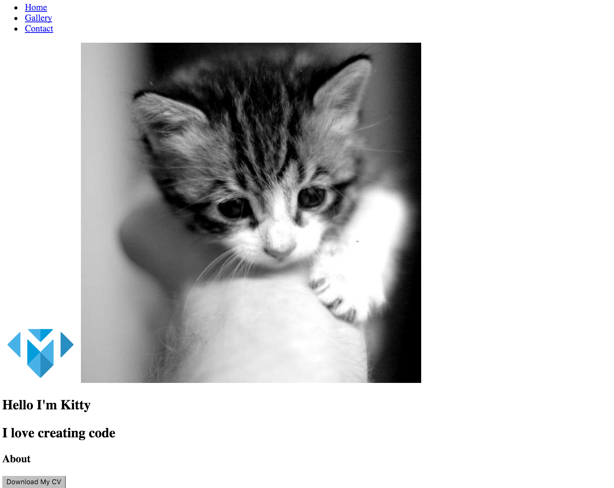

#Get started with HTML
Alright, let's get started. We will use the popular text editor Sublime Text 3 to create our files and the Chrome browser to inspect our files and run the portfolio.

You can use any text editor you feel comfortable with, for example the [Atom editor](https://atom.io/), [WebStorm](https://www.jetbrains.com/webstorm/) or just your simple old NotePad (on Windows) or TextEdit (on Mac). It really depends on your own preference and what you want from your text editor.

Let’s start by making a folder on your computer and name it **portfolio**. Inside it, let’s create an HTML file and name it **index.html**. Depending on your text editor, specifying a file with **.html** will activate syntax highlighting while you are writing the code, which makes it easier to read and work with.

> [info]
> **To boilerplate or not to boilerplate?**
> 
> Nowadays, it's considered good practice to use the [HTML5 boilerplate template](https://html5boilerplate.com/) because it sets you up to use good practices right from the start. You can  read more about it [here](http://stackoverflow.com/questions/15453299/html5-boilerplate-and-twitter-bootstrap). 
> We won't use it in this project because we are just working on a very small peronal project and we won't have the time to go into too much detail about the exact details of the boilerplate. But on your next project, you really should!

#Creating your first HTML page
> [action]
> Let’s create the basic outline of an HTML file. An HTML file consists of HTML tags and needs at least the following:
> 
> ```
> <html>
>     <head>
>         
>     </head>
> 
>     <body>
>         Hello World!
>     </body>
> </html>
> ```

These simple tags are enough to display our well known *Hello World* in the browser. Save your file and open the index.html file in the browser to make sure that everything worked as expected.

You should see something like this:



Do you spot the index.html title in the tab of the browser? 

> [action]
> Let's change that to something more appropriate - you should change this to something that reflects your name, username or anything else that you want to name your page.  In this case, it will be called "Make School's Portfolio"
>
> We can do this by adding the `<title>` tag to the `<head>` tag, which is responsible for the name of your website.
> 
> ```
> <head>
>     <title>Make School's Portfolio</title>
> </head>
> ```

Refresh your page and see how the title has changed.



OK, now let's get started in earnest. We want to put some information onto the portfolio that shows who we are and what work we have done.  But before we can do that, we have to learn about the most common ways to structure that information in the HTML.

#HTML tags

These are some of the most common HTML tags, and are ones you should definitely know:

- `<a href="url">link text goes here</a>` - Hyperlinks are created with the `a` tag. The `href` section is actually an *attribute* of the `a` tag, which specifies the url for the link.
- `<button> </button>`  Represents a clickable button.
- `<div> </div>`  Short for *division*, `div` is the generic container for content in HTML. It can be used to group elements for styling purposes or because they share attribute values. It should be used only when no other semantic element (such as `<article>` or `<nav>`) is appropriate.
- `<h1> </h1>` through `<h6> </h6>`  A *heading element* is text that briefly describes the topic of the section it introduces. There are six levels of document headings, `<h1>` is the most important and `<h6>` is the least.
- ``  Is an *image* tag, which can be used to embed an image into your page. It is a self closing tag, so unlike most other HTML tags, it has no closing tag. Note the backslash. Interestingly, this tag was [proposed by](http://1997.webhistory.org/www.lists/www-talk.1993q1/0182.html) [Marc Andreessen](https://en.wikipedia.org/wiki/Marc_Andreessen), who is now a famous tech investor.
- `<li> </li>`  is used to represent an item in a list. It must be contained in a parent element: an ordered list (`<ol> </ol>`), an unordered list (`<ul> </ul>`), or a menu (`<menu> </menu>`).
- `<ol> </ol>` is an ordered list of items. Typically, ordered-list items are displayed with a preceding numbering, which can be of any form, like numerals, letters or Romans numerals or even simple bullets.
- `<ul> </ul>`  is an unordered list of items, namely a collection of items that do not have a numerical ordering, and their order in the list is meaningless. 
- `<p> </p>`  is used to enclose a paragraph of text.
- `<span> </span>`  Like `div`, `span` is used to group elements so that they can be styled.  But unlike `div`, which works at a block level, `span` is used to group inline elements. That means that `div` tags can contain other tags inside of them, whereas `span` shouldn't. So, for example, if you wanted a single word in a paragraph of text to have a certain style, you could place `<span> </span>` tags around that word.

There are some great new HTML5 additions, that make adding components to a website quite self-explanatory. Here are a few tags that can be used to add components:

- `<article> </article>`  Represents an independent piece of content of a document, such as a blog entry or newspaper article.
- `<audio> </audio>`  Defines an audio file.
- `<footer> </footer>`  Represents a footer for a section and can contain information about the author, copyright information, et cetera.
- `<header> </header>`  Represents a group of introductory or navigational aids.
- `<nav> </nav>`  Represents a section of the document intended for navigation.
- `<section> </section>`  Represents a generic document or application section.


> [info]
> A full list of all existing HTML elements with their explanations can be found at [MDN](https://developer.mozilla.org/en-US/docs/Web/HTML/Element). An excellent source for any web related questions you might have.

<!-- Comment to break actionable boxes. -->

> [action]
> Look at the picture above and think about which HTML tags could be used to add the content on the page.

#Adding the content section by section
It's easiest to think of the website in sections. The top section of the page will contain the navigation to other pages. 

> [action]
> Delete the "Hello, World!" text, then write the HTML for the following header section, between your `<body> </body>` tags:
> 
> The top section should be a header tag with a nav tag inside. The nav tag should contain an unordered list of 3 items. Each list item should contain a link tag, like this `<a href="#">Link Text</a>`. One of those will link to *Home*, another to *Gallery* and the last to *Contact*. We will keep the urls for those blank for now as we don't have other pages to link to yet. 

<!-- Comment to break up actionable boxes. -->

> [solution]
> This is what the HTML should roughly look like:
>```
>    <header>
>      <nav>
>          <ul>
>              <li><a href="#">Home</a></li>
>              <li><a href="#">Gallery</a></li>
>              <li><a href="#">Contact</a></li>
>          </ul>
>      </nav>
>    </header>
>```

We haven't created those pages yet but we will add the `href`s now as we will create the pages soon! 

> [action] 
> Add the href for each list item by adding a path for each future page. The syntax should be like this: `href="./index.html"` for linking to the home page. Make similar paths for the other two links.

<!-- Comment to break up actionable boxes. -->

> [solution]
> Use **./** ahead of each page url to make the url path *relative* to the page that the link is on.
> ```
>    <li><a href="./index.html">Home</a></li>
>    <li><a href="./gallery.html">Gallery</a></li>
>    <li><a href="./contact.html">Contact</a></li>
> ```

Before adding the middle part of the page, let's focus on the bottom as it is only two simple additions.

> [action]
> The bottom section will contain the title (with an `h3` tag) for the bottom section and the "Download My Resume" button (using an `a` tag). Try coming up with a structure for the footer.
> Add your resume (as .pdf file) to the root folder. Use the `href` attribute of the a tag to link to your resume (something like `href="./resume.pdf"`) and the HTML5 attribute **download** to give your file a name (`download="Kitty's Resume"`). The download attribute is used to give the résumé a name. 

<!-- Comment to break up actionable boxes. -->

> [solution]
> The bottom section should contain the footer tag and within it, the title of the section as well as the button to download the résumé.
>```
>    <footer>
>        <h3>About</h3>
>        <a href="./resume.pdf" download="Kitty's Resume">Download My Resume </a>
>    </footer>
>```

We're already two-thirds of the way there with our HTML structure. Now, let's add the middle section, which will contain our main content.

> [action]
> The middle section contains our hero image, which should be a nice photo of you (don't worry about the circle shape yet), a logo and a couple of catchy phrases that bring attention to the page.
> 
> Put it all in one of the shiny new HTML5 `<section> </section>` tags. See what you can come up with! 

<!-- Comment to break actionable boxes. -->

> [solution]
> Our hero image and our logo should of course be in  tags. The two phrases could be in h1 and h2 tags to achieve a hierarchy of the two phrases.
>```
>    <section>
>        
>        
>        <h1>Hello I'm Kitty</h1>
>        <h2>I love creating code</h2>
>    </section>
>```

When you have finished adding your content to the page, refresh the browser and make sure all your content shows up in a similar fashion as the image below. 



The entire HTML file should look like this now:
> [solution]
> 
>```
>    <html>
>        <head>
>            <title>Make School's Portfolio</title>
>        </head>
>    
>        <body>
>            <header>
>                <nav>
>                    <ul>
>                        <li><a href="#">Home</a></li>
>                        <li><a href="#">Gallery</a></li>
>                        <li><a href="#">Contact</a></li>
>                    </ul>
>                </nav>
>            </header>
>    
>            <section>
>                
>                
>                <h1>Hello I'm Kitty</h1>
>                <h2>I love creating code</h2>
>            </section>
>    
>            <footer>
>                <h3>About</h3>
>                <a href="./resume.pdf" download="Kitty's Resume">Download My Resume</a>
>            </footer>
>        </body>
>    </html>
>```

Now that we have all of our content there, you can see that it is in dire need of some styling. We want to make sure that our styling looks good on mobile as well as desktop, so we will style it with resizability in mind.


    