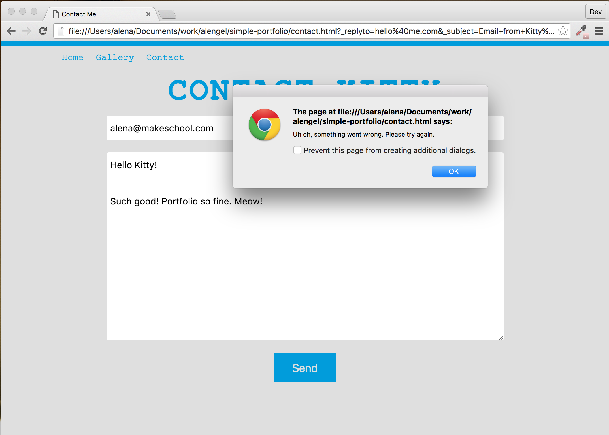

---
title: "Using Formspree.io"
slug: contact-me-2
---     

#Using the Formspree.io service
One of the drawbacks of having a static page is that you don't have a server that can receive your form elements when submitted, then process them to send it to your email. It's not possible to do this with your site's JavaScript, for security reasons. Imagine if there was a feature in JavaScript to send email. A malicious coder can write a script to send email to any address immediately upon visiting their page. That would then reveal your email address to some third party without your knowledge. Bad times.

Because it is out of the scope of this tutorial to build a server, we will make use of a service called Formspree to send us an email when a visitor submits the contact form. By looking at their [website](http://formspree.io/) you can see that setting up their service is super straightforward.

However, it's important to note that *Formspree doesn't allow us to submit a form from a local machine*. We need to host the website somewhere. We'll do that in the final section of the tutorial, so remember that as you test locally, you'll receive errors.

Looking over the [documentation](http://formspree.io/), there are quite a few input elements provided by Formspree that will help us with creating a better form while also helping us to avoid being spammed by bots!

> [action]
> Read the [documentation](http://formspree.io/) (it is very short!) and add a few more input elements and attributes to your form that you think could be useful. Particularly, consider using the `_gotcha` input element. 

<!-- Comment to break actionable boxes. -->

> [solution]
> We added the the `name` attribute to the email input to our form. We also added a `hidden` `_subject` field. That way we can send an email subject to Formspree when the user submits the form, but we won't require the user to fill out the subject. Finally, we added a [honeypot](https://en.wikipedia.org/wiki/Honeypot_(computing)) in the form of the `_gotcha` text field. That field is hidden with CSS, but a spam bot might try to automatically fill it out, not knowing that it's hidden. If it does, Formspree will catch it and delete it.
> 
> ```
>    <form class="flex column">
>                    
>      <input class="input-field" type="email" placeholder="Your Email" required name="_replyto" />
>      <textarea class="input-field" rows="10" cols="20" placeholder="Write me something nice!" required></textarea>
>    
>      <input type="hidden" name="_subject" value="Email from Kitty's Portfolio!" />
>      <input type="text" name="_gotcha" style="display:none" />
>    
>      <button class="button" type="submit">Send</button>
> 
>    </form>
> ```

If you read the Formspree documentation, you know that you must submit the form once yourself. Then you shoud receive get an email, which you need to confirm, so that Formspree knows you really want those emails. Once you've done that, all subsequent forms will be sent to your email. 

If you try to submit your form now, it will wipe the user's entries from the form, as if it was submitted, but there's a problem. We are not actually submitting the data anywhere yet. Enter JavaScript! We will now write some JavaScript that will take the data and submit it in the background. If the submission was a success, we will display a thank you message on the same page. If it fails, we will display an error.

#Using JavaScript to get the data
We will write the submission code into the empty ready function in *contact.js*. First, we should make sure the code we write is only triggered when the users submits the form. jQuery has the `submit` function for just this purpose. 

> [action]
> Select the form element with jQuery and call the [submit](https://api.jquery.com/submit/) function on it. The first parameter of the submit function is a callback function. The callback function provides access to an `event` parameter. Try putting an `alert()` into your callback function to test that your code is  working when you click the submit button.
> 
> Example use of submit:
> 
> ```
>    $('my_element').submit(function(event){ something will happen in here });
> ```

<!-- Comment to break actionable boxes. -->

> [solution]
> 
> ```
>    $('form').submit(function(event) {
>      alert('button was clicked');  
>    });
> ```

Now that we know that the `submit` function triggers when the submission button is clicked, we want to get access to the form data and submit it to Formspree using JavaScript. Formspree actually provides an option to submit directly via HTML, however if we do that Formspree will automatically redirect to their "thank you" page, unless we provide an alternative page ourselves. Instead, by sending the form to Formspree via JavaScript, we can avoid having to deal with Formspree's page, or having to create a page ourselves.

First we need to make sure that the form button doesn't try to submit the form before we have gotten the data ourselves. To do that we need to override the default form submit button behavior. JavaScript has the `preventDefault` function for that. It will prevent the default behavior for events. 

> [action]
> Call the `preventDefault` function on event parameter passed in by the submit callback.

<!-- Comment to break actionable boxes. -->

> [solution]
> `event.preventDefault();`

If you look at the Formspree documentation, you will see that there is an example on how to post data to Formspree using JavaScript. This is explained in the "Using AJAX" section. 

> [info]
> **What is AJAX?**
> 
> [Ajax](https://en.wikipedia.org/wiki/Ajax_(programming)) (short for asynchronous JavasScript and XML) is techniques for client-side scripting that communicates to and from a server or database without the need for a complete page refresh. The best definition I've read for Ajax is "the method of exchanging data with a server, and updating parts of a web page - without reloading the entire page". 
> There is of course more information on [Stackoverflow](http://stackoverflow.com/questions/1510011/how-does-ajax-work).

We can just copy and paste the Formspree's suggested [ajax](https://api.jquery.com/jQuery.ajax/) function. The `ajax` function is part of the jQuery library and as we have already included the library, we can just go ahead and use it.

> [action]
> Copy and paste the jQuery ajax function from the [Formspree documentation](http://formspree.io/). Amend the email address to your own. The parameters will pass to the `ajax` function are are `url`, `method`, `data` and `dataType`. The `method` parameter should have the value `"POST"`. This means that we want our form to *post* all the values inside of it to somewhere. That somewhere can be declared with the `url` attribute. The value is the URL declared by Formspree, with your email address appended to the end. The `data` parameter will contain the data from our form and the `dataType` should be set to `"json"`.

Now we should get the data from form and replace the `data` parameter with that content. We can do this by getting the elements of the page and using the jQuery [val](https://api.jquery.com/val/) function.  

> [action]
> In order to access the the form data, you'll have to select the form elements with jQuery - to do that, you'll have to give them each a custom `id` to select. When using an `id` to reference something in JavaScript, but not from the CSS, the best practice to prefix the `id` with `js-` to make it clear that the `id` isn't doing any styling.  So go ahead and give your email field and textarea an `id`, making sure they're prefixed with `js-`.
> 
> Replace the `data` content of the `ajax` function with your own JSON. The `data` should be a JSON object. JSON objects are like dictionaries in other languages - they're a series of key value pairs inside of curly braces like this: `{keyOne: "valueOne", keyTwo: 2}`. Use the keys `email` and `message` and set the values to the content from the form elements. Select the input elements with jQuery and then call the `val()` function on them to get their values.

<!-- Comment to break actionable boxes. -->

> [solution]
> We added the `js-email` `id` and `js-message` `id` to the respective elements:
> 
> ```
>    <input id="js-email" class="input-field" type="email" placeholder="Your Email" name="_replyto" required />
>    <textarea id="js-message" class="input-field" rows="10" cols="20" placeholder="Write me something nice!" required></textarea>
> ```
> 
> And the JS so far:
> 
> ```
>    $.ajax({
>        url: "http://formspree.io/kitty@makeschool.com", 
>        method: "POST",
>        data: {
>            email: $('#js-email').val(),
>            message: $('#js-message').val()
>        },
>        dataType: "json"
>    });
> ```

Ok, if we submit our form now, we should send the data. But what if something goes wrong? It's hard to tell what's happening, so we should give user feedback on success and error of the AJAX request. The `ajax` function offers two callback functions for this scenario, the `error` function and the `success` function. They are chained onto the `ajax` function and take a function as callback.

The `error` function has 3 parameters that come back from the request:

```
    .error(function(jqXHR, status, error){
        // Do something in here
    });
```

`jqXHR` stands for *jQuery XMLHttpRequest* - it's a helpful object that contains some information about the response from the server. But we don't need to do anything with the object in this case. The `success` function also has 3 parameters:

```
    .success(function(data, status, jqXHR) {
        // Do something in here
    });
```

Either function is called depending on the response from Formspree. If there is an error in the response, then the error function will be called, and if the request was successful, then the success function will be called.

> [action]
> Add the error and success functions to your `ajax` call. Add an `alert` into each one with a descriptive message. 
> 
> Let's wipe the form data inside the success callback by resetting the values to empty strings. That will make it clear to the user that the form was submitted. First select the form using jQuery, to do that you'll need to add a new `id` to the `form` element! Then use the [find](https://api.jquery.com/find/) function to select both the email and message elements. To select multiple elements with `find()`, pass both element `id`s in a string, separated by a comma. Chain the `val` function at the end of the `find`, and pass to `val` an empty string. This will set the selected elements to empty strings, effectively clearing the content. 
> 
> Try submitting your form afterwards. Remember, as long as you're running locally, you should recieve an error!



> [solution]
> The full contact.js file should look like this now: 
> 
> ```
>    $( document ).ready(function() {
>        
>        $('form').submit(function(event) {
>            event.preventDefault();
>    
>            $.ajax({
>                url: "http://formspree.io/alena@makeschool.com", 
>                method: "POST",
>                data: {
>                    email: $('#js-email').val(),
>                    message: $('#js-message').val()
>                },
>                dataType: "json"
>            }).error(function(jqXHR, status, error){
>                alert('Uh oh, something went wrong. Please try again.');
>            }). success(function(data, status, jqXHR) {
>                alert('Thank you for your message. Kitty will get back to you soon.');
>                $('form').find('#js-email, #js-message').val('');
>            });
>        });
>        
>    });
> ```

We get the error because we are running the form locally and Formspree doesn't allow us to submit a form from a local machine. We need to host the website somewhere. Once we do, we will be able to submit the form. So let's get our page live with Github Pages!
