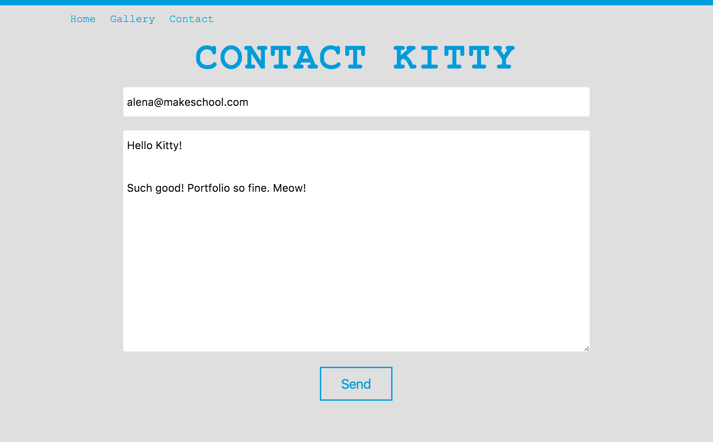
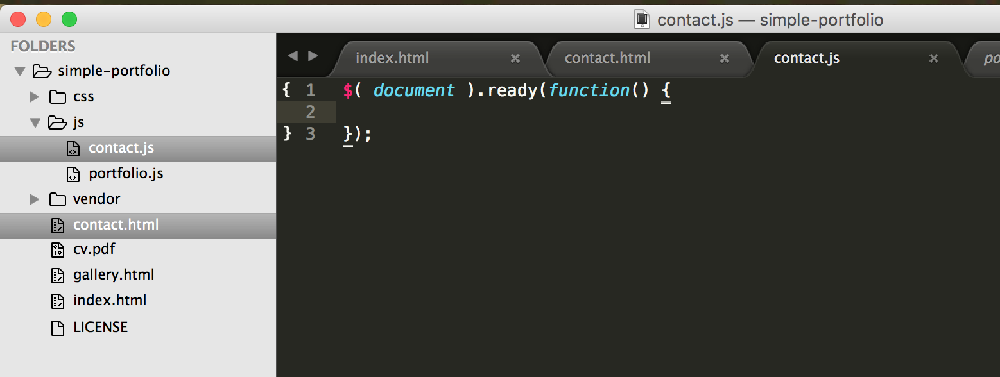

---
title: "Contact Me Form"
slug: contact-me
---     

#A Contact Me form
You've seen them everywhere, most websites have a page that will allow visitors to get in touch with the owners of the page, it might be to ask a question of interest. It might also be because they're looking to hire you! In any case, we need to give our visitors a way to get in touch. 
Of course we could just add our email address to the page but that will give spam bots a much too easy way to fill our inboxes with rather interesting stuff (not!).

We will make a Contact Me form just as the one below:



#Creating the empty Contact Me page
Just as before with the gallery page, we will repeat the process of creating a new HTML file. Let's also make a new JS file.

> [action]
> Create a new HTML file named **contact.html** in the root directory and copy and paste the HTML content from the gallery page into your new file. You probably guessed it already, delete all of the content from the HTML file except everything inside the *header* tag.
> Remove the JS and CSS files from the plugins. Create a new JS file in the **js** folder and name it **contact.js**. Put an empty jQuery **ready** function into our new JS file.



> [solution]
> The HTML file:
> ```
>    <html>
>        <head>
>            <title>Contact Me</title>
>            <link rel="stylesheet" type="text/css" href="./css/portfolio.css">
>        </head>
>    
>        <body class="default">            
>            
>            <header class="header">
>                <nav class="nav">
>                    <ul>
>                        <li class="nav-item"><a href="./index.html">Home</a></li>
>                        <li class="nav-item"><a href="./gallery.html">Gallery</a></li>
>                        <li class="nav-item"><a href="./contact.html">Contact</a></li>
>                    </ul>
>                </nav>
>            </header>
>            
>            <script src="./vendor/jquery-2.1.4.min.js"></script>
>            <script src="./js/contact.js"></script>
>    
>        </body>
>    </html>
> ```
> And our empty JS file:
> ```
>    $( document ).ready(function() {
>      
>    });
> ```

Now we are ready to begin in earnest. Let's add some form elements to our page.

#Form elements
We haven't introduced these elements yet but HTML has special elements for forms, which are called input elements. The most prominent are:

- **form** - which wraps the form. All data inside the form will be submitted.
- **input** - the element that can be a checkbox, radio button or text field depending on the *type* that is used (like this in HTML: `type="text"`). Popular [types](https://developer.mozilla.org/en-US/docs/Web/HTML/Element/input) are:
    - *checkbox* - makes a checkbox
    - *radio* - makes a radiobutton
    - *text* - makes a text field on a single line
    - *email* - validates the input to be a valid email
    - *date* - makes a date picker to select a date
    - *url* - validates the field for a URL
    - *password* - obscures the input value
- **textarea** - a special kind of text field that can expand to multiple lines, great for text as opposed to one/two words
- **button** - used with the *type="submit"* will submit your data to the URL you specify.

Those elements are enough to get us started for now as we will have quite a simple form. We will offer the user a field to enter their email and another box to enter their request. Below the form we will add a button with the submit type.

> [action]
> Add a section tag below the header and then create a form with the above elements. Add a title to your form inside the section tag but above the form tag.


> [solution]
> The HTML in its simplest form:
> ```
>    <section>
>        <h2>Contact Kitty</h2>
>        <form>
>            <input type="email" />
>            <textarea></textarea>
>            <button type="submit">Send</button>
>        </form>
>    </section>
> ```

Yeah, the form is not very pretty yet but we will make it look better in a few minutes. Before we move to styling the form, let's add placeholders and make the textarea a bit bigger. The placeholder attribute can be added to any input or textarea tag that has a text field. It's added like this: `placeholder="Put something meaningful here"` as an attribute to the tag. The textarea tag also takes the attributes rows and cols, which control how many rows and columns should be shown by default. 

> [action]
> Add a placeholder to the email input and the textarea. Add cols and rows to the textarea tag and play around with the numbers. Start with 5 for each and see what that does. We can also make use of the **required** attribute. It takes no value but when it is added to the input element, the browser validates that the input element has a value and is not empty.

<!-- Comment to break actionable boxes. -->

> [solution]
> ```
>    <input type="email" placeholder="Your Email" required />
>    <textarea rows="10" cols="20" placeholder="Write me something nice!" required></textarea>
> ```

#Styling the form
One thing that is very easy to fix for us and that we already have the classes for is the order of the form. Instead of having everything in a row, we want the form to be in a column like structure. Any idea which classes I mean? Yes, **flex** of course!

> [action]
> Add the *flex* and *column* class to the form. We also have classes for the title already. Add *title* and *sub* to the h2 tag.

With those small additions, we already have a better looking form but overall the form is still quite squashed. Let's add the button class to our button.

> [action]
> Add the *button* class to the HTML button. Reload the page.

When you have added the button class, you will see that the button is a darker gray instead of the color of our background. This is because the default color of a button is that dark gray. We need to change it by updating the button class in our CSS with the background color *transparent*. 

> [action]
> Add the property *background-color* with the *transparent* value to the *button* class. 


> [solution]
> Our HTML should look like this now:
> ```
>    <section>
>        <h2 class="sub title">Contact Kitty</h2>
>        <form class="flex column">
>            <input type="email" placeholder="Your Email" required />
>            <textarea rows="10" cols="20" placeholder="Write me something nice!" required></textarea>
>            <button class="button" type="submit">Send</button>
>        </form>
>    </section>
> ```

Let's remove the squashiness of the form by adding some margin and padding to the elements. We can also use the *border-radius* property to make the input elements less edgy.

> [action]
> Add a class to the input and textarea elements. Play with the following properties in the inspector to see what they do and what values they offer:
> - width - sets the width of the element, best set in percentage, so it resizes dynamically with the page
> - max-width - sets the maximum width of an element, great to prevent elements to become too big on bigger displays
> - margin
> - line-height - controls the height of text, use the value **em** instead of **px**
> - padding
> - font-size - use **em** here too
> - border-radius - try a small pixel value and see what this does to the edges to your input elements
> - border - you can set a border with the shorthand *1px sold black* or you can remove the border completely with the value *none*

<!-- Comment to break actionable boxes. -->

> [info]
> **What is the difference between px vs. em vs. % ?**
> 
> There is an [excellent post on CSS Tricks](https://css-tricks.com/css-font-size/), which breaks down the difference and gives good examples to what they look like. 


> [solution]
> The above form was created with the properties in the list above and the following values in the CSS:
> ```
>    .input-field {
>      width: 80%;
>      max-width: 700px;
>      margin: 1%;
>      line-height: 2em;
>      padding: 6px;
>      font-size: 1em;
>      border-radius: 3px;
>      border: none;
>    }
> ```

Now that we have our beautiful form, lets connect it to the Formspree service, so visitors can send you an email. 
