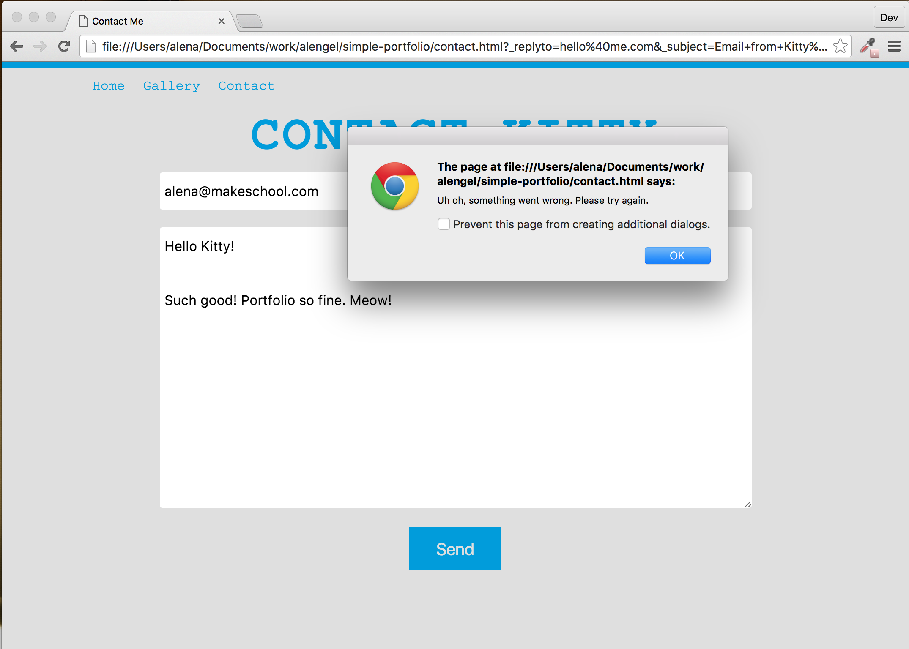

---
title: "Using Formspree.io"
slug: contact-me-2
---     

#Using the Formspree.io service
One of the drawbacks of a static page is that you don't have a server that can take your form elements and then send it to your email. Unfortunately this is not possible in JavaScript natively for security reasons. Suppose there is a feature in JavaScript to send email. Some malicious coder can write a script to send email to some address immediately when you visit their page. This will reveal your email address to some third party without your knowledge. They will start filling your mail box with lots of spam messages!

As it is out of the scope for this tutorial to build a server, we will make use of the Formspree service. Looking on their [website](http://formspree.io/) you can see that setting up their service is super straightforward.

Looking over the [documentation](http://formspree.io/), there are quite a few input elements provided by Formspree that will help us with creating a better form and also avoid being spammed by bots!

> [action]
> Read the documentation (it is very short!) and add a few more input elements or attributes that you think could be useful. Especially the **_gotcha** input should be considered. 

<!-- Comment to break actionable boxes. -->

> [solution]
> We added the following hidden input fields and name attribute (to the email input) to our form:
> ```
>    <form class="flex column">
>                    
>      <input class="input-field" type="email" placeholder="Your Email" required name="_replyto" />
>      <textarea class="input-field" rows="10" cols="20" placeholder="Write me something nice!" required></textarea>
>    
>      <input type="hidden" name="_subject" value="Email from Kitty's Portfolio!" />
>      <input type="text" name="_gotcha" style="display:none" />
>    
>      <button class="button" type="submit">Send</button>
> 
>    </form>
> ```
> Hidden input elements are hidden to the user of the form but are useful additions for the owner of the form. They can add things like the honeypot for spambots for example.

If you have read the Formspree documentation, you know that we have to submit our form once ourselves. Then we will get an email, which we need to confirm (so that Formspree knows we really want those emails). Once we've done that, all subsequent forms will be send to our email. 

If you try to submit your form right now, it will take your data and refresh the form because we are not actually submitting the data to anywhere yet. Enter JavaScript! We will now write some JavaScript that will take our data and submit it in the background. When the submit was a success, we will display a Thank You message on the same page. If it wasn't a success, we will display an error.

#Using JavaScript to get the data
We will write this JavaScript into the empty ready function in *contact.js*. First we need the JS to trigger when we submit our form. jQuery has the **submit** function for this. 

> [action]
> Select the form element with jQuery and call the [submit](https://api.jquery.com/submit/) function on it. The first parameter of the submit function is a callback function. The callback function has access to the *event* parameter. You can put an alert function into your callback function to test that your code will work when you click the button.
> 
> Example use of submit:
> ```
>    $('my_element').submit(function(event){ something will happen in here });
> ```

<!-- Comment to break actionable boxes. -->

> [solution]
> ```
>    $('form').submit(function(e) {
>      alert('button was clicked');  
>    });
> ```

Now that we have the function triggering when the button is clicked, we want to get access to the data and submit it to Formspree using JavaScript. If we submitted directly via the HTML, we have to provide a *thank you* page or our visitor will automatically be redirected to Formspree's thank you page. That means our visitor will leave our website, which we don't want! We will deal with how to avoid this in a few minutes.

First we need to take care of the button submitting the form before we have gotten the data. JavaScript has the **preventDefault** function for that. It will prevent the default behavior for events. 

> [action]
> Call the **preventDefault** function on the passed in event parameter.

<!-- Comment to break actionable boxes. -->

> [solution]
> `e.preventDefault();`

Looking at the Formspree documentation, there is an example on how to post data to Formspree using JavaScript. This is explained in the "Using AJAX" section. 

> [info]
> **What is AJAX?**
> 
> Ajax is a client-side script that communicates to and from a server/database without the need for a postback or a complete page refresh. The best definition I've read for Ajax is "the method of exchanging data with a server, and updating parts of a web page - without reloading the entire page". 
> There is of course an answer to this on [Stackoverflow](http://stackoverflow.com/questions/1510011/how-does-ajax-work).

We can just copy and paste the suggested [ajax](https://api.jquery.com/jQuery.ajax/) function. The **ajax** function is part of the jQuery library and as we have the library already included, we can just go ahead and use it. We need to change the URL to our email address. 

> [action]
> Copy and paste the jQuery ajax function from the [Formspree documentation](http://formspree.io/). Amend the email address to your own. The parameters we're passing are method, data and dataType. The **method** parameter takes the value **POST**. This means that we want our form to *post* all the values inside of it to somewhere. Somewhere can be declared with the **action** attribute. The value is the URL declared by Formspree, which ends with our email address. The parameter **data** will contain the data from our form and the **dataType** is set to JSON.

Now we should get the content of our form and replace the data parameter with our own content. We can do this by getting the elements of the page and using the jQuery [val](https://api.jquery.com/val/) function.

> [action]
> Replace the data content with your own JSON. Use the keys *email* and *message* and set the values to the content from the form elements. Select an input element with jQuery and then call the val function on it.

<!-- Comment to break actionable boxes. -->

> [solution]
> We added the email class and message class to the respective elements:
> ```
>    <input class="email input-field" type="email" placeholder="Your Email" name="_replyto" required />
>    <textarea class="message input-field" rows="10" cols="20" placeholder="Write me something nice!" required></textarea>
> ```
> And the JS so far:
> ```
>    $.ajax({
>        url: "http://formspree.io/kitty@makeschool.com", 
>        method: "POST",
>        data: {
>            email: $('.email').val(),
>            message: $('.message').val()
>        },
>        dataType: "json"
>    });
> ```

Ok, if we submit our form now, we will send the data and the form will clear. But what if something goes wrong? Clearing the form without a positive message to the user might also be confusing, so we should give user feedback on success and error of the AJAX request. Our *ajax* function offers two callback functions for this scenario, the **error** function and the **success** function. They are chained onto the *ajax* function and take a function as callback.

The *error* function takes 3 parameters that come back from the request:
```
    .error(function(jqXHR, status, error){
        // Do something in here
    });
```

The *success* function also takes 3 parameters:
```
    . success(function(data, status, jqXHR) {
        // Do something in here
    });
```

Each function is called depending on the response from Formspree. If there is an error in the response, then the error function will be called. If the request responds with success, then the success function will be called.

> [action]
> Add the error and success functions to your AJAX call. Add an alert function into each one with a descriptive message. 
> Let's also remove our form data on success by resetting the values to empty strings. Select the form using jQuery and then use the [find](https://api.jquery.com/find/) function to select the email and message class. Chain the **val** function at the end passing it an empty string. This will set the selected elements to empty strings, effectively clearing our content. 
> Try submitting your form afterwards.



> [solution]
> The full contact.js file should look like this now: 
> ```
>    $( document ).ready(function() {
>        
>        $('form').submit(function(e) {
>            e.preventDefault();
>    
>            $.ajax({
>                url: "http://formspree.io/alena@makeschool.com", 
>                method: "POST",
>                data: {
>                    email: $('.email').val(),
>                    message: $('.message').val()
>                },
>                dataType: "json"
>            }).error(function(x, status, error){
>                alert('Uh oh, something went wrong. Please try again.');
>            }). success(function(data, status) {
>                alert('Thank you for your message. Kitty will get back to you soon.');
>                $('form').find('.email, .message').val('');
>            });
>        });
>        
>    });
> ```

We get an error because we are running the form locally and Formspree doesn't allow us to submit a form from a local machine. We need to host the website somewhere. Once we do, we will be able to submit the form. So let's get our page live with Github Pages.
