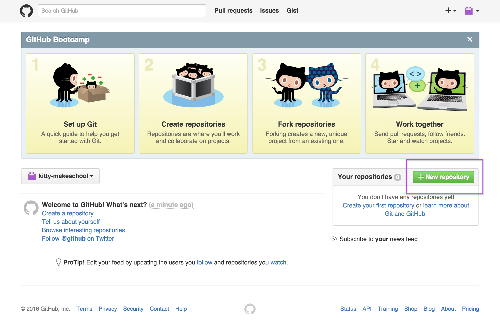
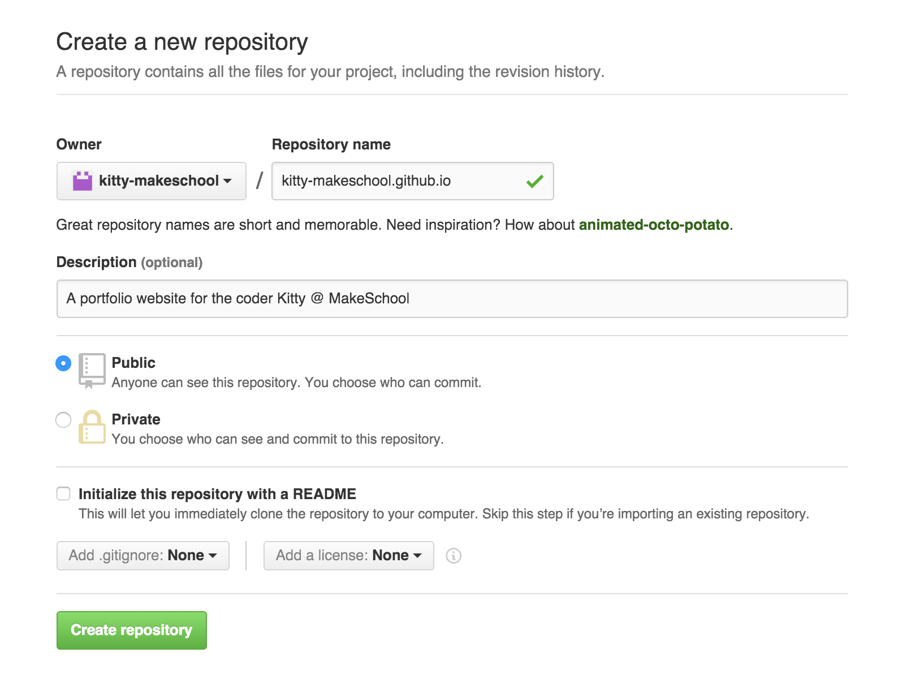
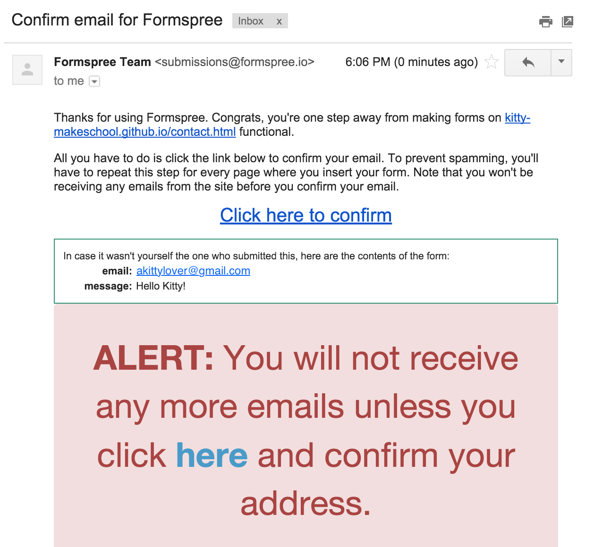
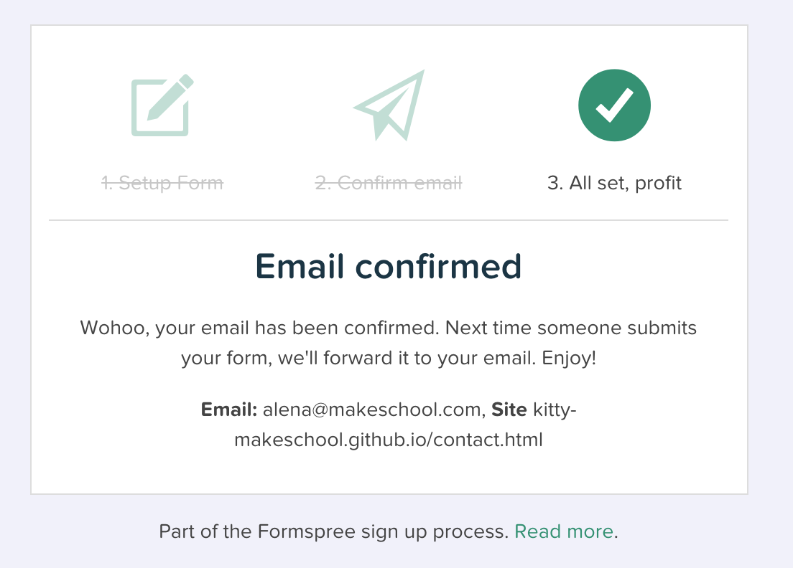

---
title: "Going live with Github Pages"
slug: github-pages
---     

#What is Github Pages - a quick recap
You probably already know Github, which is a web-based Git repository hosting service. It's great for version control and if you have a free account, it allows you to show off your code through public repositories. If you pay for Github, you can also have private repositories. [Github Pages](https://pages.github.com/) is basically Github and a website hosting service rolled into one. It allows you to have a normal repository and as soon as you push any changes to your repo, they will be published live. That is the perfect setup for our little portfolio site.

You will need to create a repo now and name it your_github_username.github.io, which will automatically make it accessible through the URL `your_github_username.github.io`. 

#Creating a Github repo
Go to [Github](https://github.com) and login if you have an account. If you don't have an account, sign up for Github. It is a very useful account to have. 

Once you're logged in, create a new repository.

> [action]
> Click on the green "New repository" button. 
>  
> 

<!-- Comment to break actionable boxes. -->

> [action]
> Name the repository `your_github_username.github.io`. Give it a meaningful description and click the "Create repository" button. **It's important to use your Github username and add the github.io, otherwise it won't work!**
> 
> 

Now that you have created a new repository, you need to clone this repository down to your local machine.

> [info]
> **Pushing to 2 repositories**
> 
> If you already created a repository to push things to the MakeSchool-17 organization, you can still use Github Pages. All you need to do is push your content from your local repository to a second remote repository. 
> You still need to follow the steps below but instead of cloning your new Github Pages repository, you will add the new Github Pages repo to your local repo as a second remote repository and then push to both. 
> Instead of cloning the new repo, go to your terminal and add the new repo as a remote repo by typing the following command:
> 
> `git remote add ghpages git@github.com:kitty-makeschool/kitty-makeschool.github.io.git`
> 
> The part before the slash is your Github username, the part after the slash is your new repository. Doing this adds a second remote repository, named `ghpages`. When you have done this, you need to push your code to this new repo by using the command: 
> 
> `git push ghpages HEAD`
> 
> This will push all of your code to the new repo. If you make any changes to your local repo, you will have to remember to push to both repos, so that the changes will be up to date on both remote repos.  

<!-- Comment to break actionable boxes. -->

> [action]
> You only need to follow the clone instructions if you are **not** pushing to two repos! If you do, then you don't need to clone and can move on to the next section - pushing to your repo.
> 
> Open your terminal and navigate to the directory where you already have your portfolio folder. Type the following command:
> 
> `git clone https://github.com/your_github_username/your_github_username.github.io.git`
> 
> Hit enter and the repository will be download. 

<!-- Comment to break actionable boxes. -->

> [info]
> **Git clone doesn't work**
> 
> If you have never used git before, you might need to [download it first](https://git-scm.com/book/en/v2/Getting-Started-Installing-Git) and install it.

Go to the directory that contains your new repo and the portfolio folder in **Finder**. 

> [action]
> Move your portfolio folder inside the new repo folder.

#Pushing to Github
Go back to your terminal and navigate to your new repo. You can change directories by using the `cd your_repo_name` command. Commit all your files by doing the following steps:

> [action]
> 
> - `git status` - this will show you all files that are new or changed
> - `git add .` - this will add all the files
> - `git commit -m 'initial commit'` - this will create the first commit - give it a meaningful message, that you can refer to later
> - `git push origin HEAD` - this pushes all of the code in your commit up to Github

When you hit enter on the last command, you will be prompted to enter your Github username and Github password before the files will be pushed up.

Now that you have all of your files up on Github, all you need to do is go to your URL `your_github_username.github.io` and look at the brand new portfolio website! You are almost done now but you still need to activate the Formspree service. 

#Activate Formspree

> [action]
> Go to your form on the **Contact Me** page and submit your first email. Once you have clicked "Send", you need to go to your email account where you should have received an email from Formspree asking you to confirm that you want in fact receive emails from this form. 

Once you have accepted the email, you are all set! 

Well done for creating your own portfolio using HTML, CSS3 and JavaScript. You've pushed your website live and it is now accessible with its own URL, which you can share with anyone you'd like or put it on your CV for prospective employers.
