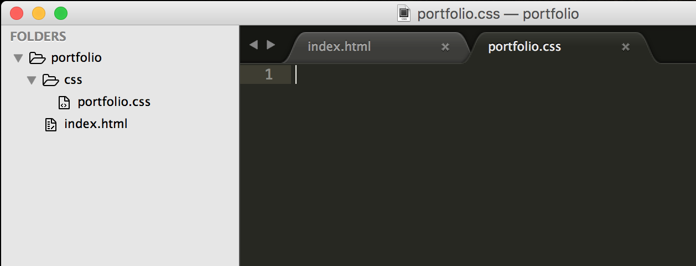
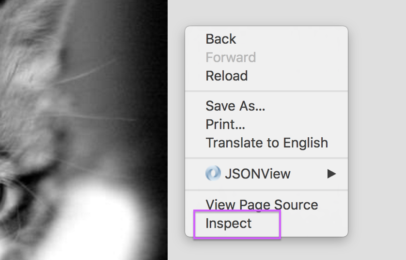
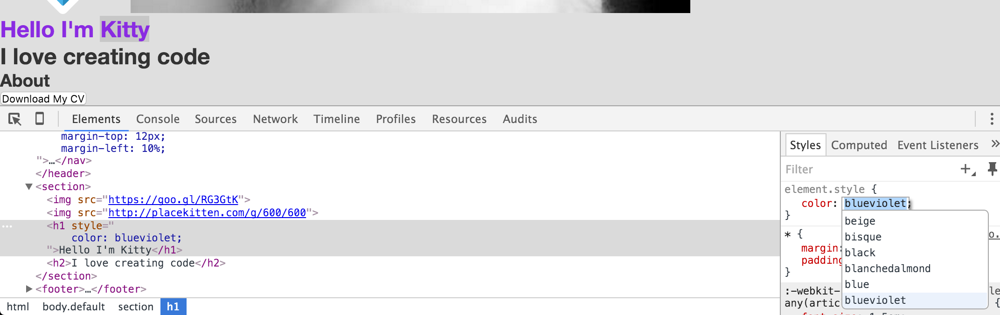

---
title: "What is CSS?"
slug: what-is-css
---     

#Adding CSS to the HTML
With our new HTML website in place, let's fix it up and make it look as awesome as the first image in the tutorial.

We'll add the CSS piece by piece, the same way we added the HTML. There are 3 ways to add CSS to our HTML but there's only one best way. 

**Option 1**

It's possible to add CSS inline by adding it to each HTML element like so:

`<h1 style="color:blue">Hello I'm Kitty</h1>`

This styles this specific element only and makes the font blue.

**Option 2**

Another way to add styling to our HTML is by putting it into the `<head>` tags by using the `<style>` tags like so:

```
<head>
    <style>
        .blue {color: blue;}
    </style>
</head>
<body>
    <h1 class="blue">Hello I'm Kitty</h1>
</body>
```

Here, we add the class **blue** to our `<h1>` tag and then reference the class in our style tag by using the **selector** .blue and giving it the **declaration** of color blue.

**Option 3**

The third option is to put the CSS into an external file with the extension **.css** and reference it in the `<head>` section like so:

```
<head>
    <title>Make School's Portfolio</title>
    <link rel="stylesheet" type="text/css" href="./css/portfolio.css">
</head>
<body>
    <h1 class="blue">Hello I'm Kitty</h1>
</body>
```

The file portfolio.css lives inside a folder called **css** (for convention and because we might make a few more CSS files). The structure of the CSS inside the new portfolio.css file looks like this:

```
.blue {
    color: blue;
}
```

> [action]
> Can you see how similar option 3 is to option 2? What option do you think is the best of all 3? And why do you think that is?

<!-- Comment to break actionable boxes. -->

> [solution]
> Option 1 makes the HTML file quite difficult to read as it mixes our markup language with styling. It also prevents us from reusing any of the styling but instead having to set each style explicitly. Option 2 is better in that regard because
> 
> - it provides a clear separation of markup from styling
> - it produces cleaner HTML markup
> - is more efficient, because selectors to apply rules to multiple elements on a page. This is good because you can re-style multiple elements by changing the CSS in one place, improving management and development speed.  Also, less CSS rules are repeated, which makes your page size smaller
> 
> The same arguments can be applied to option 3. However, option 3 has even more advantages. Imagine you have 2 pages on your website, which you eventually will!. If your styles are declared at the top of each HTML file, then you can't reuse them between the two HTML pages. You would have to declare the same styles like background color and font color in each HTML file. With option 3 though, you can declare them only once in the external style sheet and pull it in with the `<link>` tag instead. Neat, huh?
> 
> Other advantages include:
> - CSS as separate files are a lot easier to maintain from a development perspective
> - the file can be cached by browsers for performance 
> - you only have to change the CSS rules in one place, rather than for each file

#What is CSS exactly?
OK, so let's go with the last option for our project by adding a folder called **css** into our portfolio folder. It will contain all of our CSS files.

> [action]
> Add a folder called css to your project and add a file to it called portfolio.css.



Once you have added the file, we need to add some selectors into our HTML and then add some rules to them. We've briefly talked about selectors before, but what are they exactly?

> [info]
> **CSS Terminology**
> 
> Applying a style to an HTML element is done by CSS selectors. There are several selectors but for now we are most interested in:
>
> - *class* selectors (can be reused in the document)
> - *id* selectors (can only be used on one element only)
> - *tag* selectors (styles all tags of this kind)
>
> - The **class** selector is added to an HTML element using the `class` attribute. For example, here we specifiy that this `h1` tag should be of class `blue`: `<h1 class="blue">Hello Kitty</h1>`. In the CSS we can create a class by using a dot before the class name, like this:
> 
> ```
>    .blue {
>        color: blue;
>    }
> ```
> - The **id** selector is added to an HTML element using the `id` attribute. Here we specify that this `h1` tag should have `id` `blue`: `<h1 id="blue">Hello Kitty</h1>`. In the CSS we can create an id by using a hashtag before the id name, like this:
> 
> ```
>    #blue {
>        color: blue;
>    }
> ```
> - The **tag** selector is not added to the HTML at all. Instead we reference the HTML tag in the CSS directly like so:
> 
> ```
>    h1 {
>        color: blue;
>    } 
> ``` 
> With this method, every `h1` tag will have this style applied.
>
>
> The keyword `color` is the **property** we are changing, while `blue` is the **value** we're applying. 

OK, let's get going and actually add some styles! Start by adding the `<link>` tag to the `<head>` element. 

> [action]
> Add the following code to your HTML file:
> 
> ```
>    <head>
>        <title>Make School's Portfolio</title>
>        <link rel="stylesheet" type="text/css" href="./css/portfolio.css">
>    </head>
> ```

Now to test that the two files are actually connected.

> [action]
> Add any of the above styles to the CSS and don't forget to add a selector in your HTML if you need to. Has any of the HTML changed color? If yes, the files are connected. If not, make sure that you have used the right file path in the href.

<!-- Comment to break actionable boxes. -->

> [solution]
> In the HTML file, you should add something like this to your HTML:
> `<h1 class="blue">Hello I'm Kitty</h1>` or `<h1 id="blue">Hello I'm Kitty</h1>`
> You can also add nothing into your HTML and use the tag selector in the CSS instead. 
> Then, add one of the following matching class, id or tag selectors into the css:
> 
> ```
> 	  /* class selector */
>    .blue {
>        color: blue;
>    }
> 
>    /* id selector */
>    #blue {
>        color: blue;
>    }
> 
>    /* tag selector */
>    h1 {
>        color: blue;
>    } 
> ```
> Once you've done this, then you should see the title "Hello I'm Kitty" in blue. 

#Using the Inspector
One thing that makes the lives of web developers much easier is the inspector. It's a tool that comes with Chrome, Firefox and many other browsers. It might be called different things but is usually accessed by right clicking on your website and clicking **Inspect** or **Inspect element**. 



Depending on where you clicked, the inspector will show you the CSS properties of the element that your cursor was over. The best part is that you can change the CSS properties right there  in the browser and see the changes immediately on the page.


When you add a property to an element, the inspector also offers you to autocomplete the values by giving you any available choices. This is a great way to explore which properties and values exist, and what they do. Go ahead, play around a bit before moving on. This is an extremely valuable skill to have!
