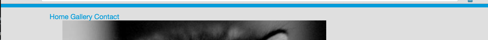

---
title: "Basic Styling"
slug: basic-styling
---     

#Styling the portfolio
Now that the files are connected, let's add some basic rules to our CSS to make the page look more colorful. One way to do that is to add some background color to the page. Pick any color you like, keeping in mind that your users will have to see that page and you want to make a good impression and keep your text legible.

> [action]
> Use the tag selector for body and add a rule to it in the CSS file. Remember that a tag selector has no dot nor hashtag, then add curly brackets and within it, the following rule:
> ```
>    background-color: #dfdfdf;
> ```
> Save your file and check out your portfolio so far. 

Now that you know how it's done, let's add some more default styles to our CSS file like the color of our font, the font type itself and color for our links. The default styles provided by each browser aren't very fancy nowadays, so let's put some style onto that page!

> [action]
> Come up with a few rules that you always want to see on your page and add them to the same body tag. Here are some examples of things you could add:
> 
> - color of the font
> - font-family (changes the font type you use)
> - font-size 
> - more [CSS properties](https://developer.mozilla.org/en-US/docs/Web/CSS/Reference), click through each property to see what they do
>
> You can see lots of ideas of what CSS can do in the [CSS Zen Garden](http://www.mezzoblue.com/zengarden/alldesigns/).
>
> A good place to find some colors to add to your page is [color-hex](http://www.color-hex.com/). If you're looking for fonts, try [cssfontstack](http://www.cssfontstack.com/).

<!-- Comment to break actionable boxes. -->

> [info]
> **Hex values, RGB and more**
>
> You've probably noticed that I used the word blue in our first example to set the font color. But with the background-color, I used hex values. It's also possible to use RGB values. There's a good write up on Wikipedia [here](https://en.wikipedia.org/wiki/Web_colors) about web colors, so just go ahead and find out more about the differences between these.

#Basic Styling for the Header
First we add the border at the top. We've chosen the color that we already have in the logo. There are simple Chrome extensions out there that can help you with selecting a color from a web page, like [Colorzilla](https://chrome.google.com/webstore/detail/colorzilla/bhlhnicpbhignbdhedgjhgdocnmhomnp) for example.

> [action]
> Add a top border to the header. The property **border** can take 3 shorthand values. The first one is the type of border you want (solid, dotted, dashed), the second parameter is the size of the border in pixels and the last parameter is the color. 

<!-- Comment to break actionable boxes. -->

> [solution]
> Don't forget to add a class to your header tag in the HTML!
> ```
>    .header {
>      border-top: solid 8px #019cdb;
>    }
> ```

Now if you reload the page, do you see that there is some spacing between the border and the top of the page? Why do you think that is? 

This is one of those cases where all browsers display it slightly different. Each browser vendor uses their own default stylesheet to display certain elements. One of the things they do is add a default margin and padding to HTML elements. One way to prevent this, is to use a normalized stylesheet (as mentioned in the boilerplate info box). We will just use a very simplified version for that by adding the following rules to the very top of our CSS file.

> [action]
> Add this rule to your stylesheet and see what that does to your border:
> ```
>    * {
>      margin: 0;
>      padding: 0;
>    }
> ```

Now that has made all the difference! This resets the browsers stylesheet to make all HTML elements have 0 as a default value for the margin and padding. There's more that can be done here but for sake of simplicity, we leave it at that for now. If you're more interested in this topic, head [here](http://nicolasgallagher.com/about-normalize-css/) to read more about it.

Now that we have a nice border at the top, let's make our links look better than the dotted list we currently have. There are two things we want to achieve here. We want to make the links display horizontally rather than vertically in a list. On top of that, we want to remove the dots that prefix each list item and remove the underline of the links. And while we're at it, we should position the navigation better as a whole and have the links be a different color when a user hovers over each item.

> [action]
> Make the list vertical by using the rule `display:inline;` and `list-style:none;` on the list items. Add some margin to our nav tag to move it away from the left and down from the top. Don't forget to use classes!

<!-- Comment to break actionable boxes. -->

> [solution]
> In the CSS file:
> ```
>    .nav {
>      margin-top: 12px;
>      margin-left: 10%;
>    }
>    
>    .nav-item {
>      list-style: none;
>      display: inline;
>    }
> ```
>
> In the HTML file:
> ```
>    <header class="header">
>        <nav class="nav">
>            <ul>
>                <li class="nav-item"><a href="#">Home</a></li>
>                <li class="nav-item"><a href="#">Gallery</a></li>
>                <li class="nav-item"><a href="#">Contact</a></li>
>            </ul>
>        </nav>
>    </header>
> ```

As we want the link changes to be sitewide and not just for this instance, let's use the tag selectors for the links. You also need to use the pseudo selector :hover to change the link color on hover. It is used by adding **:hover** after your selector. In this instance, you would use **a:hover** as a selector to change the link color on hover. 

> [action]
> Use the a tag selector to add a default color to links and remove the underline of the link. The text-decoration property will help you.

<!-- Comment to break actionable boxes. -->

> [solution]
> ```
>    a {
>      color: #019cdb;
>      text-decoration: none;
>    }
>    
>    a:hover {
>      color: #48b2e8;
>    }
> ```

This should achieve something like this: 



#Positioning the Content
After the header, let's take care of the main content. 

#Basic Styling for the Footer

Once you have had some time adding CSS properties to your page, make sure the page looks like you expected. Below is a solution that will style the page to look like the page we showed at the beginning of this tutorial. It will give you an idea of things you can add to the page that will make the page more colorful and modern. Don't get ahead of yourself in terms of centering the content and making the image circular. We'll cover this in the next part using CSS3.

> [solution]
> Just in case, we lost you somewhere, here are the HTML and CSS file that will make the page look like this:
> PIC here
>  
> Code here