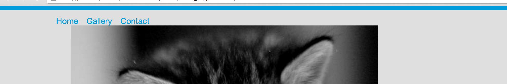
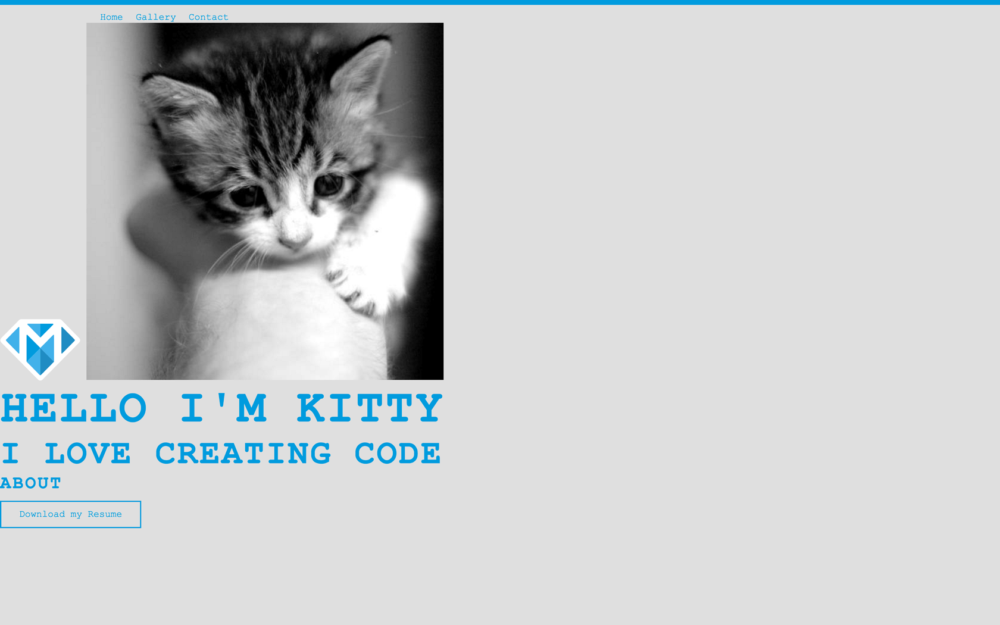

---
title: "Basic Styling"
slug: basic-styling
---     

#Styling the portfolio
Now that the files are connected, let's add some basic rules to our CSS to make the page look better. One way to do that is to add some background color to the page. Pick any color you like, keeping in mind that your users will have to see that page and you want to make a good impression and keep your text legible.

> [action]
> Use the tag selector for `body` and add a rule to it in the CSS file. Remember that a tag selector has neither dot nor hashtag, then add curly brackets and within it, the following rule:
> 
> ```
>    background-color: #dfdfdf;
> ```
> Save your file and check out your portfolio so far. 

The default styles provided by each browser aren't very fancy, so now that you know how it's done, let's add some more default styles to our CSS file.

> [action]
> Come up with a few rules that you always want to apply to your page and add them to the same `body` tag. Here are some examples of things you could add:
> 
> - color of the font
> - font-family (changes the typeface)
> - font-size 
> - more [CSS properties](https://developer.mozilla.org/en-US/docs/Web/CSS/Reference), click through each property to see what they do
>
> You can see lots of ideas of what CSS can do in the [CSS Zen Garden](http://www.mezzoblue.com/zengarden/alldesigns/).
>
> A good place to find some colors to add to your page is [Adobe Color](https://color.adobe.com/explore/most-popular/?time=all). If you're looking for fonts, try [cssfontstack](http://www.cssfontstack.com/) to see what's built-in, and [Google Fonts](https://www.google.com/fonts) to see hosted fonts you can add to your page.

<!-- Comment to break actionable boxes. -->

> [info]
> **Hex values, RGB and more**
>
> You've probably noticed that I used the word blue in our first example to set the font color. But with the background-color, I used hex values. It's also possible to use RGB values. There's a good write up on Wikipedia [here](https://en.wikipedia.org/wiki/Web_colors) about web colors. Note that it's better that you specify colors exactly, using hex or RGB, rather than using HTML color names, like `blue` or `maroon`. 

<!-- Comment to break actionable boxes. -->

> [solution]
> Here is the CSS that we used to style some basics on our page:
> 
> ```
>    body {
>      background-color: #dfdfdf;
>      color: #333333;
>      font-family: 'Courier New', Courier, 'Lucida Sans Typewriter', 'Lucida Typewriter', monospace;
>    }
> ```
> It's good to set a group of fonts as some operating systems might not have the first font you specified, and will fall back to the second specified font. If that one doesn't exist, it will try the third one, etc.

#Basic styling for the header
First we add the border at the top. We've chosen the color that we already have in the logo. There are simple Chrome extensions out there that can help you with selecting a color from a web page, like [Colorzilla](https://chrome.google.com/webstore/detail/colorzilla/bhlhnicpbhignbdhedgjhgdocnmhomnp) for example.

> [action]
> Add a top border to the header. The best way to do that is to make a CSS class called `header`. That class will contain the `border-top` property, which takes 3 values, separated by spaces. The first one is the type of border you want (`solid`, `dotted`, or `dashed`), the second parameter is the size of the border in pixels (`10px` for example) and the last parameter is the color. 

<!-- Comment to break actionable boxes. -->

> [solution]
> Don't forget to add a class to your header tag in the HTML!
>
> ```
>    .header {
>      border-top: solid 8px #019cdb;
>    }
> ```

Now if you reload the page, do you see that there is some spacing between the border and the top of the page. Why do you think that is? 

This is one of those cases where all browsers display things slightly different. Each browser vendor uses their own default stylesheet to display certain elements. One of the things they do is add a default `margin` and `padding` to HTML elements. One way to prevent this is to use a normalized stylesheet, like [HTML5 Boilerplate](https://html5boilerplate.com/) mentioned earlier. We will use a very simplified version by adding the following rules to the very top of our CSS file.

> [action]
> Add this rule to the very top of your stylesheet, then see what it does to your border:
> ```
>    * {
>      margin: 0;
>      padding: 0;
>    }
> ```

Now that has made all the difference! This resets the browser's stylesheet to make all HTML elements have `0` as a default value for the `margin` and `padding`. There's more that can be done, but for sake of simplicity, we'll leave it at that for now. If you're interested in this topic, head [here](http://nicolasgallagher.com/about-normalize-css/) to read more about it.

Now that we have a nice border at the top, let's make our links look better than the unordered list we currently have. First, we want to make the links display horizontally rather than vertically. Also, we want to remove the dots that prefix each list item and remove the underline of the links. While we're at it, we should position the navigation better and have the links be a different color when a user hovers over each item.

> [action]
> Make the list vertical by using the rule `display:inline;` and `list-style:none;` on the list items. To do this, you'll want to make a new class, and apply it to each of the list items. Also, make a different new class to add some margin to the nav tag to move it away from the left and down from the top.

<!-- Comment to break actionable boxes. -->

> [solution]
> In the CSS file:
> 
> ```
>    .nav {
>      margin-top: 12px;
>      margin-left: 10%;
>    }
>    
>    .nav-item {
>      list-style: none;
>      display: inline;
>      margin-right: 12px;
>    }
> ```
>
> In the HTML file:
> 
> ```
>    <header class="header">
>        <nav class="nav">
>            <ul>
>                <li class="nav-item"><a href="#">Home</a></li>
>                <li class="nav-item"><a href="#">Gallery</a></li>
>                <li class="nav-item"><a href="#">Contact</a></li>
>            </ul>
>        </nav>
>    </header>
> ```

We want the link changes to be site-wide and not just for this file, so we'll use tag selectors for the links. You need to use the [pseudo-class](http://www.w3schools.com/css/css_pseudo_classes.asp) `:hover` to change the link color on hover. It is invoked by adding `:hover` after your selector. In this case, we will use `a:hover` as a selector to change the link color on hover. 

> [action]
> Use the `a` tag selector to add a default color and remove the underline of links. The `text-decoration` property will help you remove the underlines. Use the `a:hover` pseudo-class to change the link hover color.

<!-- Comment to break actionable boxes. -->

> [solution]
> 
> ```
>    a {
>      color: #019cdb;
>      text-decoration: none;
>    }
>    
>    a:hover {
>      color: #48b2e8;
>    }
> ```
> This should achieve something like this: 
>
> 

#Basic styling for the footer
The footer has only two items that need styling, so let's do that next. The header text in the footer should be changed to make it look more like a title.  It should be centered in the page, have a different color and we'll make it all caps to make it stand out. Also we should style the download button to make it look more buttony. 

> [action]
> Create a new class called *title* and use it to change the font color, letter case and text alignment of the "About" header.  You can do that with the `color`, and `text-transform` properties. Also, consider messing with the `letter-spacing` property to give it some character. Create another class, called *footer-sub* and use it to make the `font-size` of the "About" header larger.  We'll end up using the *title* class in other places, but we'll want to have different font-sizes for those, so it makes sense to put the `font-size` rule in a different class.

<!-- Comment to break up actionable boxes. -->

> [solution]
> We added one class for rules that the other titles have in common called *title* and another class called *footer-sub* that will control the font-size of this particular title.
> 
> In the HTML file:
> 
> ```
>    <footer>
>        <h3 class="footer-sub title">About</h3>
>        <a href="./resume.pdf" download="Kitty's Resume">Download My Resume</a>
>    </footer>
> ```
> In the CSS file:
> 
> ```
>    .title {
>      color: #019cdb;
>      text-transform: uppercase;
>      letter-spacing: 3px;
>    }
> 
>    .footer-sub {
>      font-size: 30px;
>    }
> ```

Later, we'll add two horizontal lines left and right of the title. That will require some flexbox magic, so let's hold off on that until a bit later, when we will cover flexbox in-depth.

Let's focus our attention on the button. First, we should to give the button a border to make it look like a button. We should also color it in in a way that matches the rest our page and we should also give it a hover effect, so that it feels more clickable to users.

> [action]
> Add a border to the button - play with the options that the inspector provides to get a feel for what styles are available. You want to use these properties: `border`, `display:inline-block;`, and `padding`. For the hover effect, you need to use the pseudo-class `:hover` again, but this time use it with your `button` class.

<!-- Comment to break up actionable boxes. -->

> [solution]
> Add a class to the link in the HTML: 
> 
> ```
>    <a href="./resume.pdf" download="Kitty's Resume" class="button">Download My Resume</a>
> ```
> 
> And then we add the following rules to the class and use the pseudo selector :hover.
> 
> ```
>    .button {
>      border: 2px solid #019cdb;
>      color: #019cdb;
>      display: inline-block; /* To wrap the border just around the content */
>      font-size: 20px;
>      margin-top: 12px;
>      padding: 12px 30px;
>    }
>    
>    .button:hover {
>      background-color: #019cdb;
>      color: #dfdfdf;
>      cursor: pointer; /* This ensures that the cursor changes on hover */
>    }
> ```
> This should achieve something like this: 
>
> 


#Basic styling of the main content
For now, let's focus on changing the font size, color and type of the main content.

> [action]
> Create two new classes, for the main title and sub-title. Pick a font you like on [cssfontstack](http://www.cssfontstack.com/) and add it to the class selector of your main title and sub title. Then select a color for the font as well as a size for the font and add it to the rules. The rules that you might want to look into are `text-transform`, `letter-spacing` and `font-size`. Of course, feel free to use the `.title` class you've already created, too.

<!-- Comment to break up actionable boxes. -->

> [solution]
> You need to add a class to the h1 and h2 tag. In this case, we reused the `title` class from the footer and added a separate class for each title to manipulate the font-size.
>
> The HTML file:
> 
> ```
>    <section>
>        
>        
>        <h1 class="main title">Hello I'm Kitty</h1>
>        <h2 class="sub title">I love creating code</h2>
>    </section>
> ```
> 
> The CSS file:
> 
> ```
>    .main {
>      font-size: 78px;
>    }
>    
>    .sub {
>      font-size: 57px;
>    }
> ``` 
> This should achieve something like this: 
>
> 

Make sure the page looks like you want by spending some time adding some CSS to your page. Below is a solution that will style the page to look like the one we showed at the beginning of the tutorial, which you may do if you like, or you can do something different. Don't get ahead of yourself in terms of centering the content and making the image circular. as we'll cover that in the next part using CSS3.

> [solution]
> Just in case we lost you somewhere, here are the HTML and CSS files that will make the page look like this:
> 
>  
> HTML file: 
> 
> ```
>    <body>
>      <header class="header">
>          <nav class="nav">
>              <ul>
>                  <li class="nav-item"><a href="#">Home</a></li>
>                  <li class="nav-item"><a href="#">Gallery</a></li>
>                  <li class="nav-item"><a href="#">Contact</a></li>
>              </ul>
>          </nav>
>      </header>
>    
>      <section>
>          
>          
>          <h1 class="main title ">Hello I'm Kitty</h1>
>          <h2 class="sub title">I love creating code</h2>
>      </section>
>    
>      <footer>
>          <h3 class="footer-sub title">About</h3>
>          <a href="./cv.pdf" download="Kitty's CV" class="button">Download My CV</a>
>      </footer>
>    </body>
> ```
> 
> And the CSS file so far:
> 
> ```
>    * {
>      margin: 0;
>      padding: 0;
>    }
>    
>    body {
>      background-color: #dfdfdf;
>      color: #333333;
>      font-family: 'Courier New', Courier, 'Lucida Sans Typewriter', 'Lucida Typewriter', monospace;
>    }
>    
>    a {
>      color: #019cdb;
>      text-decoration: none;
>    }
>    
>    a:hover {
>      color: #48b2e8;
>    }
>    
>    .header {
>      border-top: solid 8px #019cdb;
>    }
>    
>    .nav {
>      margin-top: 12px;
>      margin-left: 10%;
>    }
>    
>    .nav-item {
>      list-style: none;
>      display: inline;
>      margin-right: 12px;
>    }
>    
>    .title {
>      color: #019cdb;
>      text-transform: uppercase;
>      letter-spacing: 3px;
>    }
>    
>    .main {
>      font-size: 78px;
>    }
>    
>    .sub {
>      font-size: 57px;
>    }
>    
>    .footer-sub {
>      font-size: 30px;
>    }
>    
>    .button {
>      border: 2px solid #019cdb;
>      color: #019cdb;
>      display: inline-block; /* To wrap the border just around the content */
>      font-size: 20px;
>      margin-top: 12px;
>      padding: 12px 30px;
>    }
>    
>    .button:hover {
>      background-color: #019cdb;
>      color: #dfdfdf;
>      cursor: pointer;
>    }
> ```
