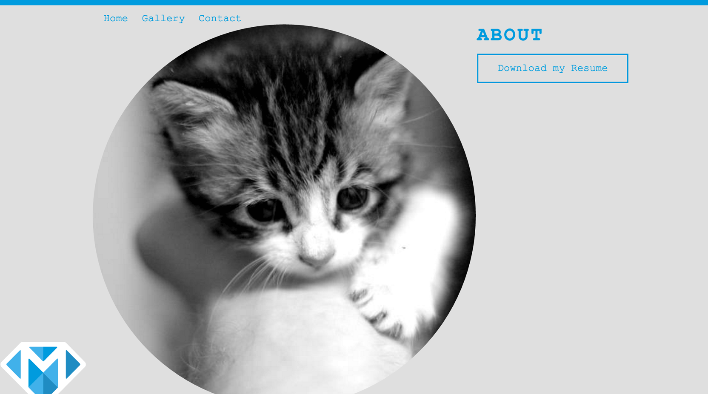
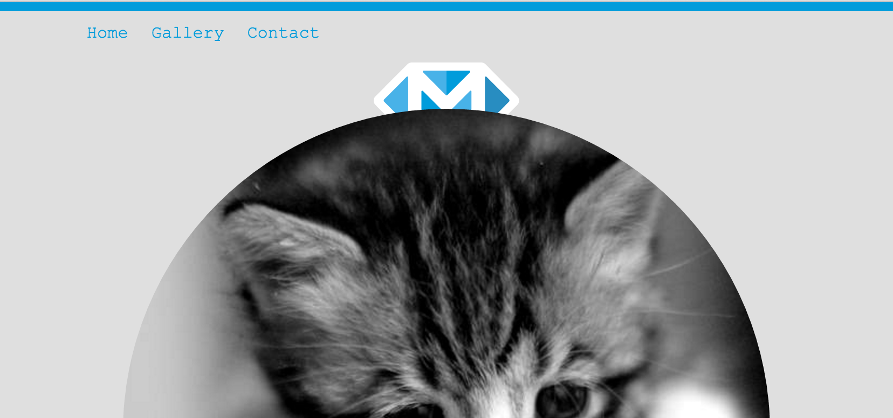

---
title: "Using CSS3"
slug: using-css3
---     

#A circular image
Now let's do some additional styling to the main content. The kitten image should be round, we want the logo to be positioned above the kitten, and the two phrases should be centered on the image. Things like making circular images and even centering content on web pages used to be a dark art in front-end web development. However, thanks to the latest advances in CSS, we can now forget those terrible times and use the power of flexbox to get everything in place! 

Now that we have some basic styling, let's get everything into place! We also want to make our main image circular, so let's start with that. We are going to use some new CSS3 rules for this. One trick to make the image round is to use the **property** border-radius. Applying a border-radius of 50% (or 100% - why one or the other? Read about it [here](http://jessica-eldredge.com/2014/09/07/border-radius-50-or-100-percent/).) to an element makes it a circle.

> [info]  
> **The box model of HTML elements**
>
> In an HTML document, each element is represented as a rectangular box. Determining the size, properties — like its color, background, borders aspect — and the position of these boxes is the goal of the rendering engine (inside the browser).
> In CSS, each of these rectangular boxes is described using the standard box model. This model describes the content of the space taken by an element. Each box has four edges: the **margin** edge, **border** edge, **padding** edge, and **content** edge.
> 
> 
> 
> The **content** area is the area containing the real content of the element. It often has a background, a color or an image.
>
> The **padding** area extends to the border surrounding the padding. When the content area has a background, color, or image set on it, this will extend into the padding, which is why you can think of the padding as extending the content. The padding is located inside the padding edge.
>
> The **border** area extends the padding area to the area containing the borders. It is the area inside the border edge.
>
> The **margin** area extends the border area with an empty area used to separate the element from its neighbors. It is the area inside the margin edge.

<!-- Comment to break actionable boxes. -->

> [action]
> Add a class to your image. Make sure that your image is a perfect square otherwise the circle won't work! Now add the border-radius rule to your image class.

<!-- Comment to break actionable boxes. -->

> [solution]
> It should be something like this in the HTML:
> 
> ```
>    
> ```
> And the CSS is as simple as:
> 
> ```
>    .circle {
>      border-radius: 50%;
>    }
> ```

#Centering elements with flex
Now, that we know a bit more about box models, let's try to use that knowledge to center our content. We want to use one of the newest rules in the CSS realm that has turned our world upside down when it comes to positioning things on a web page. This used to involve a lot of [hacks](http://stackoverflow.com/questions/2017809/what-is-the-best-way-to-center-a-webpages-content-using-css) and [ugliness](http://stackoverflow.com/questions/10872688/how-to-center-body-on-a-page) but now that we have [flexbox](https://philipwalton.github.io/solved-by-flexbox/demos/vertical-centering/), we have found a nice and consistent way to position things on our pages.

The flexbox concept might be a bit of beast to wrap your head around, so let's go through it step by step. We don't want to center everything but just our main content section and our footer, so let's wrap a div around those two sections to keep the two sections together. I like to remember div as the "dividing" element. It's a great element to keep your content on the page organized.

> [action]
> Make a class called flex in your CSS file and then add the class to the new div tag around the section and the footer. Add the following rules to the flex class in your CSS:
> 
> ```
>    display: -webkit-box;  /* OLD - iOS 6-, Safari 3.1-6, BB7 */
>    display: -ms-flexbox;  /* TWEENER - IE 10 */
>    display: -webkit-flex; /* NEW - Safari 6.1+. iOS 7.1+, BB10 */
>    display: flex;         /* NEW, Spec - Firefox, Chrome, Opera */
> ```
> Why did we add four rules instead of just one? See the info box at the bottom of this step but ultimately, we still have to cater for various browser versions that implement the same style using different rules. All newer browsers use the `display:flex;` rule but older browsers still need their **vendor prefix**. A good page to check if a prefix is needed for a rule, is [http://shouldiprefix.com/](http://shouldiprefix.com/).

If you now reload the browser, you should see that the content moved but didn't get centered. The content has now aligned itself horizontally. If you read about flexbox, you'll know why but let's recap. Flex has two different ways to align elements and the default setting is horizontally (or like a row). To change it's default behavior, we have to use the property **flex-direction**. 



> [action]
> Add another class called *column* and add the rule flex-direction to it. Add the class to the HTML. We keep them separate as we are going to use the flex class again!

<!-- Comment to break actionable boxes. -->

> [solution]
> Your flex class should look like this
> 
> ```
>    .flex {
>      display: -webkit-box;  /* OLD - iOS 6-, Safari 3.1-6, BB7 */
>      display: -ms-flexbox;  /* TWEENER - IE 10 */
>      display: -webkit-flex; /* NEW - Safari 6.1+. iOS 7.1+, BB10 */
>      display: flex;         /* NEW, Spec - Firefox, Chrome, Opera */
>    }
> 
>    .column {
>      flex-direction: column;
>    }
> ```

The content is now back into the correct order but our image is all squashed and oval-shaped! That's because it is trying to take up all the available space. We need to tell it that we just want it centered. We will use the rule **align-items:center;** for that.

> [action] 
> Add this rule to your flex class: 
> 
> ```
>    align-items: center;
> ```

Once you have saved your files, reload your browser and voil&#224;! Our content is perfectly centered! 

> [info]
> **When can I use new CSS3 rules?**
>
> As a developer it is important that you stay up to date on new technologies and it's also fun to start playing with new technologies. However, it is also important that you are aware that not all browsers will start supporting new ideas right away or maybe in different ways. This might mean that you have to make the decision to either use a new technology at the risk of it not being supported by all browsers, which could mean that you will have some users not being able to access your site or certain features of it. This can of course be prevented by [graceful degradation](https://www.w3.org/wiki/Graceful_degradation_versus_progressive_enhancement#Graceful_degradation_and_progressive_enhancement_in_a_nutshell) but it's best if you are aware of it in the first place. A good source to test if a feature is available and can be used without any issues is the excellent site [Can I Use?](http://caniuse.com/).
> As we have decided to use flexbox and border-radius, our page does not support users on IE8 (for the border-radius) and IE9 (for flexbox). To get support in IE10 and IE11, we need to use vendor-prefix. This means that our content will not have a circle image and won't be centered.
> Any ideas how we could cater for those older browsers?

<!-- Comment to break actionable boxes. -->

> [solution]
> You guessed it, graceful degradation! In this case we could make use of the older hacks on how to center our content and come up with a different way to make the image circular. Alternatively, we could load in different stylesheets based on browser features. This requires some more logic in the `<head>` tag or some JavaScript. The source code of the [HTML5 Boilerplate](https://github.com/h5bp/html5-boilerplate/blob/master/src/index.html) might give you an idea on how that is done if you are interested in finding out more. 

#The z-index
Now, let's move the content into the correct place vertically. We want the logo to be on top of the circular image and we want the titles across the circular image. 

> [action]
> Add some margin to the bottom of your header tag. This will position it lower and will avoid the logo covering the navigation links when the browser window is resized. Once you're done with this let's use some **negative** margin on the top of the circular image to move it below the logo. Negative margin can be used just like regular margin. It will just move the box element in the opposite direction. Let's add a new class for that called main-img as we might need the circle class at a later point to make more elements round. 

<!-- Comment to break actionable boxes. -->

> [solution]
> You should have something like the following rules in your CSS:
> 
> ```
>    .header {
>      border-top: solid 8px #019cdb; 
>      margin-bottom: 18px; /* new addition */
>    }
>    
>    .main-img {
>      margin-top: -60px;
>    }
> ```
> And your HTML should have a new class on the image:
> 
> ```
>    
> ```
> Your website should now look like this:
> 
> 

Oops! Our logo is hidden behind the circular image. This has to do with how our HTML elements are rendered onto the page and the box models we introduced earlier. Because we have the logo first in the HTML followed by the main image, the main image will be rendered last or "on top" of what has come before. But there is a nifty CSS property that overrides the order of things. The z-index property allows you to change the order of elements on the page (but should be used sparingly). The higher the index, the more "on top" the image. 

> [action]
> Add a class to the logo and add the rule **z-index: 2;** to it. Our logo is a bit big, so we will resize it too by using the width property. Don't set width and height to fixed pixel values as that will most likely distort the image (unless it's a square and you are reusing the proportions).

<!-- Comment to break actionable boxes. -->

> [solution]
> The HTML should be:
> 
> ```
>    
> ```
> And the CSS is as simple as:
> 
> ```
>    .logo {
>      z-index: 2;
>      width: 100px;
>    }
> ```

Now the logo is where it is supposed to be and a more agreeable size. Let's move the titles into the right place too, right on top of the circular image. However we want the footer to stay where it is for now. The easiest way for this is make the footer sticky first. This is another useful web skill!
