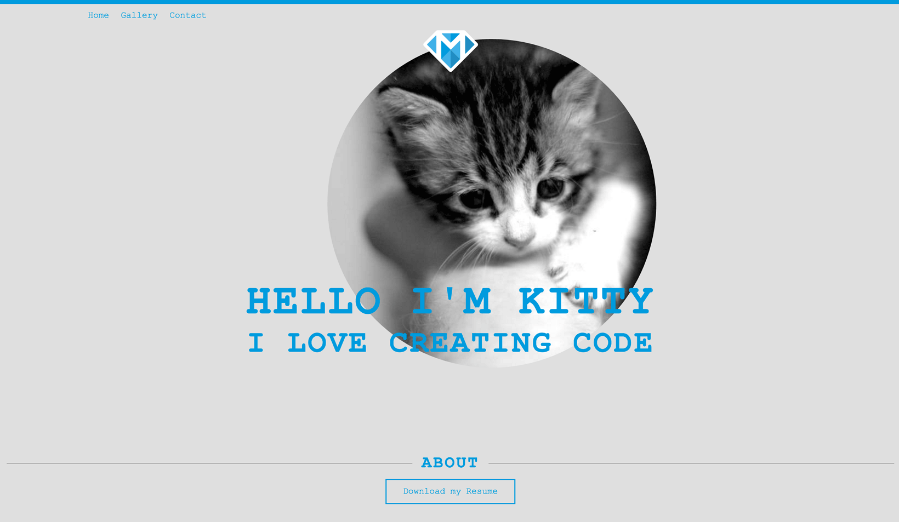

---
title: "A Sticky Footer"
slug: sticky-footer
---     

#A sticky footer
One thing we're still missing from the footer is those lines next to "About". We will be using a little trick from our dev kit for those. To achieve those lines, we will add a `<div>` tag before and after the `<h3>` and give it a top border. We are basically adding two boxes but because they will be empty with just one border, they will look just like lines.

> [action]
> Add a class to the footer tag and use **text-align:center;** to center the text inside the footer. Add a div before and another div after the h3 tag inside the footer. Add a class to the two divs called *line*. And while we're at it, let's wrap the three elements (div, h3, div) into another div to keep this section contained. Inside the line class, add a rule for border-top and make the width 100%. Div elements have 0 height and width without any content, so we are telling the element to be 100% width of the available space.

<!-- Comment to break actionable boxes. -->

> [solution]
> The HTML:
> 
> ```
>    <footer class="footer">
>        <div>
>            <div class="line"></div> 
>            <h3 class="footer-sub title">About</h3>
>            <div class="line"></div>
>        </div>
>        <div class="button">Download My CV</div>
>    </footer>
> ```
> The CSS so far:
> 
> ```
>    .footer {
>      text-align: center;
>    }
>
>    .line {
>      border-top: 1px solid #828282;
>      width: 100%;
>    }
> ```

Alright, we almost have a perfect looking footer, the only thing is that the lines are over and under the "About" header, not left and right to it. Any idea on how we might change this?


I hope your answer was flexbox! Because then you are quite right. Remember how we spoke about flexboxes' default setting being a row? That will be very useful right now. Let's use flex on the surrounding div.

> [action]
> Add flex to the div surrounding the line divs and h3 tag. Reload the browser. Do you see how the lines are short? That's because the footer is centered and doesn't take up all the space of the page. Add **width:100%;** to the footer class to change that. Do you see how the horizontal line goes all the way to the edge of the page and touches the "About" header? Let's change that by adding some left and right margin to the line class. The whole footer is very close to the bottom to the page, so add some bottom margin to the footer class to give it some space.

> [solution]
> The CSS:
> 
> ```
>    .footer {
>      text-align: center;
>      width: 100%;
>      margin-bottom: 2%;
>    }
>    
>    .line {
>      border-top: 1px solid #828282;
>      width: 100%;
>      margin-left: 1%;
>      margin-right: 1%;
>    }
> ```

And now to the sticky footer! We need to employ CSS3 trickery to keep the footer at the bottom. This also used to be a very hacky thing in web development but has also been improved thanks to CSS3!

We will make use of the new css viewport units, which allows us to calculate the height of the main content and tell the browser to put the footer below it. This requires us to know the height of the footer but that's all!

> [action]
> Add a div around the entire content except the footer tag. Then add a class to it and add the following rule to the class:
> 
> ```
>      min-height: calc(100vh - 126px);
> ```

<!-- Comment to break actionable boxes. -->

> [solution]
> Adding the above rule to the class *main-wrapper* will calculate the view height (**vh**) and subtract the height of the footer from it. This will always push the footer just below any other content that is on the page.
>
> The HTML should be like this:
> 
> ```
>    <body class="default">             
>      <div class="main-wrapper">
>          <header class="header">
>              <nav class="nav">
>                  <ul>
>                      <li class="nav-item"><a href="#">Home</a></li>
>                      <li class="nav-item"><a href="#">Gallery</a></li>
>                      <li class="nav-item"><a href="#">Contact</a></li>
>                  </ul>
>              </nav>
>          </header>
>          
>          <div class="flex column">
>              <section>
>                  <div class="flex column">
>                      
>                      
>                  </div>
>                  <h1 class="main title ">Hello I'm Kitty</h1>
>                  <h2 class="sub title">I love creating code</h2>
>              </section>
>          </div>
>      </div>
>    
>      <footer class="footer">
>          <div class="flex">
>              <div class="line"></div> 
>              <h3 class="footer-sub title">About</h3>
>              <div class="line"></div>
>          </div>
>          <div class="button">Download My CV</div>
>      </footer>
>    </body>
> ```

Alright, we're almost there. The only thing left to do is to move the titles on top of the image and resize the image, so that everything fits onto one page. Of course, we could have the user scroll up and down but a best first impression of our portfolio will be made when the visitor can see everything at a glance.

Let's move the titles up, so that we get to see the footer. This is easily done by using a negative top margin again. We can add a negative margin to each title individually but it would be much easier to just have a wrapping div around it and pull them both up at the same time.

> [action]
> Add a div to surround the h1 and h2 tags. Give it a class name and add a rule to it in the CSS using a negative top margin until the footer is on the page. Add the flex and the column class to the new div too, so that our titles stay nice and centered.

<!-- Comment to break actionable boxes. -->

> [solution]
> In HTML:
> 
> ```
>    <div class="titles flex column">
>        <h1 class="main title ">Hello I'm Kitty</h1>
>        <h2 class="sub title">I love creating code</h2>
>    </div>
> ```
> 
> And in CSS:
> 
> ```
>    .titles {
>      margin-top: -22%;
>    }
> ```

Last but not least, let's make the image smaller. Ideally it takes up the center portion of our website, so we can make use of percentage values when setting a width to the image. Now we will run into a problem. In the next part we will make our page resizable on mobile, so we can't just set a fixed width to the image. Instead let's put a div around our main-image and resize that based on a percentage of our entire page. Anything inside that new wrapping div will be resized to its parent container.

> [action]
> Put a wrapping div around the img tag with the circular image. Add a class to that new div and give it a width in percentage units. It should be small enough to get the footer back onto the page but big enough to still make a splash. 

<!-- Comment to break actionable boxes. -->

> [solution]
> In HTML: 
> 
> ```
>    <div class="img-wrapper">
>        
>    </div>
> ```
> 
> And in CSS:
> 
> ```
>    .img-wrapper {
>      width: 60%;
>    }
> ```

And there you have it, a portfolio page where everything is perfectly in place!



> [solution]
> If we lost you somewhere, here's the current HTML file:
> 
> ```
>    <html>
>      <head>
>          <title>Make School's Portfolio</title>
>          <link rel="stylesheet" type="text/css" href="./css/portfolio.css">
>      </head>
>    
>      <body class="default">            
>          
>          <div class="main-wrapper">
>              <header class="header">
>                  <nav class="nav">
>                      <ul>
>                          <li class="nav-item"><a href="#">Home</a></li>
>                          <li class="nav-item"><a href="#">Gallery</a></li>
>                          <li class="nav-item"><a href="#">Contact</a></li>
>                      </ul>
>                  </nav>
>              </header>
>              
>              <div class="flex column">
>                  <section>
>                      <div class="flex column">
>                          
>                          <div class="img-wrapper">
>                              
>                          </div>
>                      </div>
>                      <div class="titles flex column">
>                          <h1 class="main title ">Hello I'm Kitty</h1>
>                          <h2 class="sub title">I love creating code</h2>
>                      </div>
>                  </section>
>              </div>
>          </div>
>      
>          <footer class="footer">
>              <div class="flex">
>                  <div class="line"></div> 
>                  <h3 class="footer-sub title">About</h3>
>                  <div class="line"></div>
>              </div>
>              <div class="button">Download My CV</div>
>          </footer>
>    
>      </body>
>    </html>
>```
>
> And our CSS file so far:
> 
> ```
>    * {
>      margin: 0;
>      padding: 0;
>    }
>    
>    body {
>      background-color: #dfdfdf;
>      color: #333333;
>      font-family: 'Courier New', Courier, 'Lucida Sans Typewriter', 'Lucida Typewriter', monospace;
>    }
>    
>    a {
>      color: #019cdb;
>      text-decoration: none;
>    }
>    
>    a:hover {
>      color: #48b2e8;
>    }
>    
>    .header {
>      border-top: solid 8px #019cdb;
>      margin-bottom: 18px;
>    }
>    
>    .nav {
>      margin-top: 12px;
>      margin-left: 10%;
>    }
>    
>    .nav-item {
>      list-style: none;
>      display: inline;
>      margin-right: 12px;
>    }
>    
>    .title {
>      color: #019cdb;
>      text-transform: uppercase;
>      letter-spacing: 3px;
>    }
>    
>    .main {
>      font-size: 78px;
>    }
>    
>    .sub {
>      font-size: 57px;
>    }
>    
>    .footer-sub {
>      font-size: 30px;
>    }
>    
>    .button {
>      border: 2px solid #019cdb;
>      color: #019CDB;
>      display: inline-block; /* To wrap the border just around the content */
>      font-size: 20px;
>      margin-top: 12px;
>      padding: 12px 30px;
>    }
>    
>    .button:hover {
>      background-color: #019CDB;
>      color: #dfdfdf;
>      cursor: pointer;
>    }
>    
>    .circle {
>      border-radius: 50%;
>    }
>    
>    .flex {
>      display: -webkit-box;  /* OLD - iOS 6-, Safari 3.1-6, BB7 */
>      display: -ms-flexbox;  /* TWEENER - IE 10 */
>      display: -webkit-flex; /* NEW - Safari 6.1+. iOS 7.1+, BB10 */
>      display: flex;         /* NEW, Spec - Firefox, Chrome, Opera */
>      align-items: center;
>    }
>    
>    .column {
>      flex-direction: column;
>    }
>    
>    .footer {
>      text-align: center;
>      width: 100%;
>      margin-bottom: 2%;
>    }
>    
>    .row {
>      flex-direction: row;
>    }
>    
>    .main-img {
>      margin-top: -54px;
>    }
>    
>    .logo {
>      z-index: 2;
>      width: 100px;
>    }
>    
>    .line {
>      border-top: 1px solid #828282;
>      width: 100%;
>      margin-left: 1%;
>      margin-right: 1%;
>    }
>    
>    .main-wrapper {
>      min-height: calc(100vh - 126px);
>    }
>    
>    .titles {
>      margin-top: -22%;
>    }
>    
>    .img-wrapper {
>      width: 60%;
>    }
> ```

But hold on, try resizing the browser into a smaller size. Uh oh, now the font is way too big for our mobile screen and the layout looks broken! 


Let's get that fixed in the next part where we work with CSS media queries.
