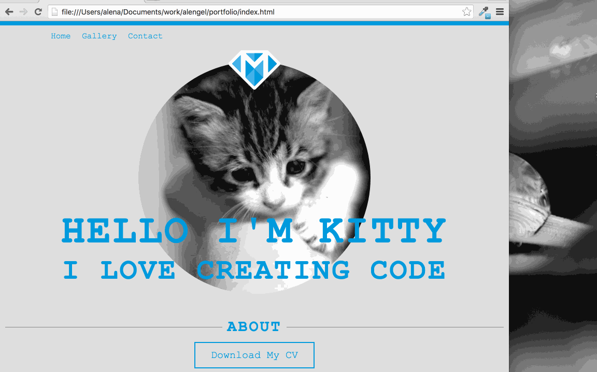

---
title: "Making it Mobile Friendly"
slug: mobile-friendly
---     

#CSS Media Queries Breakpoints
We have our portfolio, which is looking nice on a desktop but nowadays we can count on the fact that many visitors will be accessing the page from a mobile device. This can be a tablet or a smartphone, so we want to take that into account. 

Our friend here is the CSS media query. It's supported by all browsers except IE8, [which is hardly used anymore](http://caniuse.com/usage-table). CSS3 media queries go in the CSS file. They check for a certain width (as declared by the developer) and apply the styles that were declared within the media query. 

Here is a simple example:

```
    .header {
      font-size: 20px;
    }

    @media (max-width: 481px) {
      .header {
        font-size: 12px;
      }
    }
```

We declare that if the screen has a maximum width of 481 pixels, (i.e. is less than 481 pixels wide), we want the `header` `class` to change the font size to 12 pixels. When the screen width is greater than 480, everything within the `header` `class` will use a font size of 20 pixels. 

Now that we know how media queries work, we should discuss the best breakpoints for the devices we want to support. A breakpoint is the screen size where the css transitions from one set of rules to another, based on the media queries. There's quite a debate in the web world about the best breakpoints, as there are so many devices out there. The latest best practice is to set breakpoints based on the content of your page, rather than try to set a breakpoint for every possible device. As you can imagine, that could become quite cumbersome, and with new devices coming out all the time, it would become an endless exercise in trying to keep up to date with the latest device. 

So let's set 4 breakpoints, one for smartphones in portrait mode (BP1), one for smartphones in landscape mode (BP2), one for tablets in portrait mode (BP3) and one for tablets in landscape mode and regular desktops (BP4). We already set all the rules for BP4, which can also be seen as the default breakpoint, so we don't have to do anything there.

There are many ideas for which numbers work best out there, but we'll go with the following for now:

- BP1: max-width: 481px
- BP2: max-width: 767px
- BP3: max-width: 992px
- BP4: anything above 992px

#Letting the browser resize the image dynamically
One thing we can take care of right away is to make the image resizable and to tell the browser handle the dynamic resizing of the image. Two simple additions to our image class will do that.

> [action]
> Add `max-width: 100%;` and `height: auto;` to the `main-img` class. Reload your browser and then resize it. Can you see the difference? `max-width` tells the browser to give the image a maximum width of 100% when possible. Setting the `height` to `auto` will resize the height automatically based on the width. This is great because it prevents any distortion of the image and keeps the proportions accurate.

<!-- Comment to break actionable boxes. -->

> [solution]
> The CSS for `main-img`:
> 
> ```
>    .main-img {
>      margin-top: -60px;
>      max-width: 100%;
>      height: auto;
>    }
> ```

Now that we have taken care of ensuring the image always stays proportional, let's take care of the text. For that we will use more media queries!

#Resizing the font
When you resize the browser to a width that is smaller than the width of your text, the text will no longer fit on one line, and instead wrap onto the next line. That won't look so nice, so let's reduce the font size on smaller screens, so that it will fit.

> [action]
> Add a media query for the first of the three breakpoints. Pay attention to the curly brackets and make sure that any size-specific rules are inside of your breakpoint. Inside the media query for  BP1, add the `main` and `sub` class including their rules. Change the `font-size` rule to make the fonts smaller when it is on a screen smaller than 481 pixels. Resize your screen between 480 pixels to normal desktop size and watch what happens. If you have your inspector open while you resize, Chrome will tell you the size of your browser in the top right.


> [solution]
> 
> ```
>    @media (max-width: 481px) { 
>      .main {
>        font-size: 34px;
>      }
>    
>      .sub {
>        font-size: 24px;
>      }
>    }
> ```



You can see that the font looks quite pleasant in devices 480 pixels wide and below. Now that we know how the `font-size` can be adjusted, let's adjust it for the sizes between BP1 and BP4. 

> [action]
> Add media queries for the other two breakpoints and add the `main` and `sub` classes to them as necessary. Adjust the `font-size` to a pleasing number that will keep the title from wrapping onto the next line.
> *You might not need all the media queries for all of your selectors!* You should instead do what looks good.

<!-- Comment to break actionable boxes. -->

> [solution]
> When adding the media queries, you'll notice that the media query for BP3 is unnecessary for the website as the font resizes nicely with the default style:
> 
> ```
>    @media (max-width:767px) { 
>      .main {
>        font-size: 64px;
>      }
>    
>      .sub {
>        font-size: 46px;
>      }
>    }
> ```

However, if you resize from a full width browser (of at least 1000 pixels) to 480 pixels, you will see that there is a `font-size` jump between 480 pixels to 630 pixels. You might also have noticed that the media query at 480 pixels is not working anymore! Instead it's being superceded by the 767 query. The reason is that the media query at 767 also applies to the media query at 480. The `max-width` we set applies to any screen below 767 pixels. We can stop that from happening by setting a `min-width` to that media query starting at 481 pixels.

> [action] 
> Add min-width to the media query with breakpoint 767. Connect the two by using the `and` operator. For example, `@media (min-width: 481px) and (max-width: 767px) {`

<!-- Comment to break actionable boxes. -->

> [solution]
> 
> ```
>    @media (min-width: 481px) and (max-width:767px) { 
>      .main {
>        font-size: 64px;
>      }
>    
>      .sub {
>        font-size: 46px;
>      }
>    }
> ```

Now your media query should behave as expected again. But we still have some text wrapping issues between 480 and 630 pixels. Remember when we said that media queries that should not always follow specific screen sizes, but instead should work with the content of the page? This is an example right here. Let's fix that by adding a media query for that range.

> [action]
> Add a media query for the range 481 - 630 and adjust the titles to prevent them from wrapping. 

<!-- Comment to break actionable boxes. -->

> [solution]
> 
> ```
>    @media (min-width: 481px) and (max-width:630px) { 
>      .main {
>        font-size: 46px;
>      }
>    
>      .sub {
>        font-size: 33px;
>      }
>    }
> ```

#Chrome's device inspector
We've already used our trusty Chrome inspector to set and change CSS rules, but the inspector has a few more tricks in its repertoire. Chrome can simulate a mobile device for you! You can turn on device mode by clicking on the small phone icon in the top-left hand corner of the inspector. 


There is a drop-down that allows you to choose from a range of devices (iPhones, iPads and even some Android and Kindle devices). There is also the option to rotate your site from portrait to landscape mode. 


You can see how the image is quite small. There's also a lot of whitespace and the image is not making as much of a splash anymore. Let's fix that by using media queries and making use of the device inspector.

#Resizing the image
This is going to be easy, as we already know how to use media queries for various breakpoints. We just need to add the `img-wrapper` class to the media queries and adjust the images' parent container to resize nicely on smaller screens.

> [action]
> Add the `img-wrapper` class to the media queries that need adjusting and set the width to a size that gives it more of an impact but keeps the design of our site intact.

<!-- Comment to break actionable boxes. -->

> [solution]
> 
> ```
>    @media (max-width: 481px) { 
>      ...
>    
>      .img-wrapper {
>        width: 95%;
>      }
>    }
>    
>    @media (min-width: 481px) and (max-width:630px) { 
>      ...
>    
>      .img-wrapper {
>        width: 75%;
>      }
>    }
>    
>    @media (min-width: 630px) and (max-width:767px) { 
>      ...
>    
>      .img-wrapper {
>        width: 65%;
>      }
>    }
> ```

And now we have an almost fully responsive site! Nice work! Now let's expand the content and add some more pages to the website.
