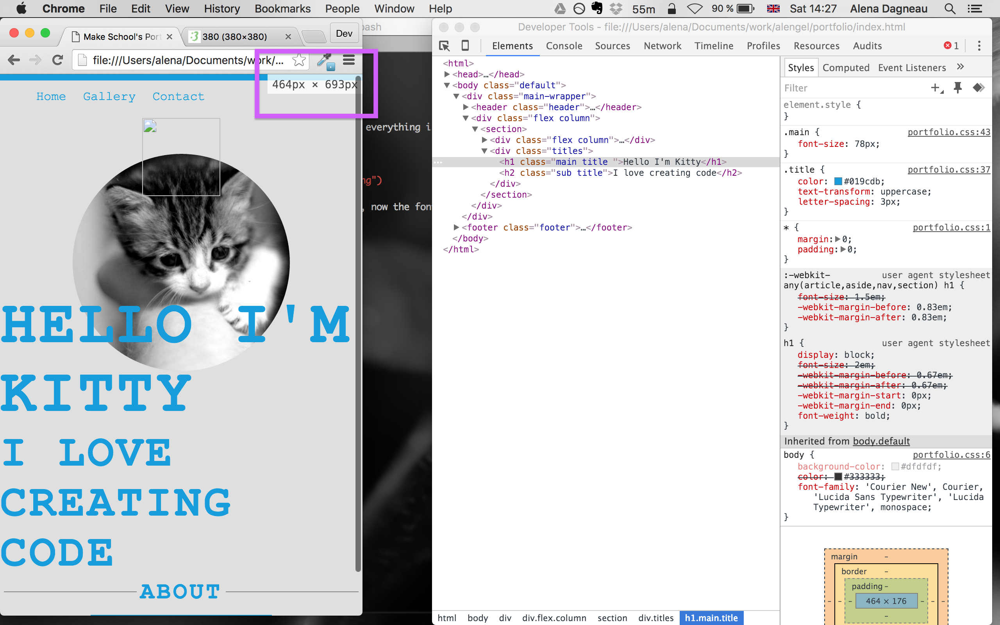
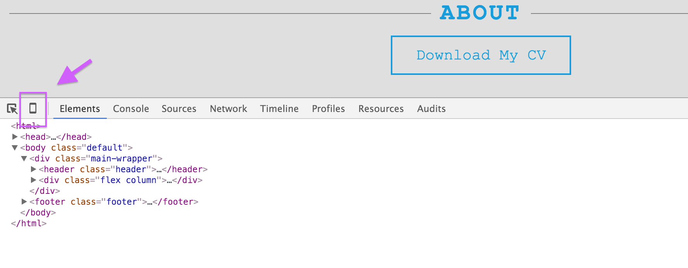
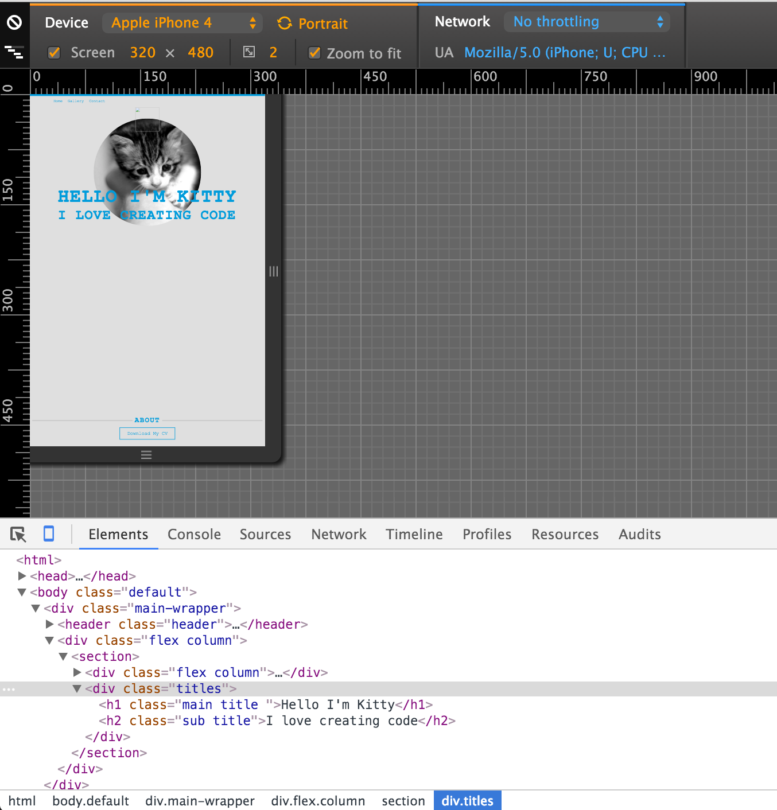

---
title: "Making it Mobile Friendly"
slug: mobile-friendly
---     

#CSS Media Queries Breakpoints
We have our portfolio, which is looking nice on a desktop but nowadays we can count on the fact that our visitors will be accessing our portfolio from a mobile device. This can be a tablet or a smartphone, so we want to take all of that into account. 

Our friend here is the CSS media query. It is supported by all browsers except IE8 ([which is hardly used anymore](http://caniuse.com/usage-table)). CSS3 media queries are used in the CSS file. They check for a certain width (as declared by the developer) and apply the styles that were declared within the media query. 

Here is a simple example:

```
    .header {
      font-size: 20px;
    }

    @media (max-width: 481px) {
      .header {
        font-size: 12px;
      }
    }
```

We declare that if the screen has a maximum width of 481 pixels, so is less that 481 pixels, we want the class header to change the font size to 12 pixels. Everywhere where we will have the class header, our font size will 12 pixels. Everywhere else, we will have the header class still use the font size of 20 pixels. 

Now that we know how media queries work, we should discuss the best breakpoints for the devices we want to support. There's quite a debate in the web world about the best breakpoints as there are so many devices to support. The latest "best practice" chooses to set breakpoints based on the content of your page rather than try to set a breakpoint for each device out there. As you can imagine, that could become quite cumbersome and with new devices coming out all the time, an endless exercise in keeping up to date with the latest device. 

So let's set 4 breakpoints, one for smartphones in portrait mode (BP1), one for smartphones in landscape mode (BP2), one for tablets in portrait mode (BP3) and one for tablets in landscape mode and regular desktops (BP4). We already set all the rules for BP4, which can also be seen as the default breakpoint, so we don't have to do anything here anymore.

There are many suggestions on which breakpoints are best out there, but we'll go with the following for now:

- BP1: max-width: 481px
- BP2: max-width: 767px
- BP3: max-width: 992px
- BP4: anything above 992px

#Resizing the image
One small thing we can take care of right away is making our image resizable and letting the browser handle the dynamic resizing of the image. Two simple additions to our image class will handle this.

> [action]
> Add **max-width: 100%;** and **height: auto;** to the *main-img* class. Reload your browser and then resize it. Can you see the difference? Max-width tells the browser to give the image a maximum width of 100% where possible and setting the height to auto will resize the height automatically based on whatever the width is. This is great because it prevents any distortion of the image and keeps the proportions accurate.

<!-- Comment to break actionable boxes. -->

> [solution]
> The CSS for main-img:
> ```
>    .main-img {
>      margin-top: -54px;
>      max-width: 100%;
>      height: auto;
>    }
> ```

Now that we have taken care of our circular image always staying in proportion, we should allow it to take up the remaining white space if there is space available. For that we will use our media queries.

#Resizing the font
When you resize the browser to a width that is smaller than its height, the font will not fit anymore and instead wrap onto the next line. That is not as nice as we had before, so let's reduce the font size on smaller screens, so that it will fit.

> [action]
> Add a media query for the first three breakpoints. Pay attention to the curly brackets and that any rules are inside of it. Inside the media query for the first breakpoint, add the *main* and *sub* class including their rules. Change the font-size rule to make it smaller when it is on a screen smaller than 480 pixels. Resize your screen from 480 pixels to normal desktop size. If you have your inspector open while you resize, Chrome will tell you the size of your browser in the top right. The first number is the width of your browser, the second number the height.



> [solution]
> ```
>    @media (max-width: 481px) { 
>      .main {
>        font-size: 78px;
>      }
>    
>      .sub {
>        font-size: 57px;
>      }
>    }
> ```

PUT A GIF HERE OF RESIZING BROWSER

You can see that our font looks quite pleasant in devices below 480 pixels and our default width. Now that we know how the font-size can be adjusted, let's adjust it in the in between sizes as well. 

> [action]
> Add media queries for the other two breakpoints and add the main and sub classes to it. Adjust the font-size to a pleasing number that will keep the title from wrapping onto the next line.
> *Remember that you might not need all the media queries!*

<!-- Comment to break actionable boxes. -->

> [solution]
> When adding the media queries, you'll notice that the media query for BP3 is unnecessary for our website as the font resizes nicely with our default style. We added only:
> ```
>    @media (max-width:767px) { 
>      .main {
>        font-size: 64px;
>      }
>    
>      .sub {
>        font-size: 46px;
>      }
>    }
> ```

However, if you resize from a full width browser (of at least 1000 pixels) to 480 pixels, you will see that there is a jump of the font size between 480 pixels to 630 pixels. You might also have noticed that the media query at 480 pixels is not working anymore but instead the media query at 767 kicked in. The reason for that is that the media query at 767 also fulfills the media query at 480. The max-width we set accounts for any screen below 767 pixels. We can stop that from happening by setting a min-width to that media query starting at 481 pixels.

> [action] 
> Add min-width to the media query with breakpoint 767. Connect the two by using the **and** operator. 

<!-- Comment to break actionable boxes. -->

> [solution]
> ```
>    @media (min-width: 481px) and (max-width:767px) { 
>      .main {
>        font-size: 64px;
>      }
>    
>      .sub {
>        font-size: 46px;
>      }
>    }
> ```

Now your media query should behave as expected again. But this doesn't solve the jumping between 480 and 630 pixels. Remember how we talked about media queries that should not follow any screen sizes but instead should work with the content of the page? This is a use case for it right here. We added some media queries for a couple of widths but our titles are still wrapping between those 480 and 630. Let's fix that by adding a media query for that range.

> [action]
> Add a media query for this range and adjust the titles to prevent them from wrapping. 

<!-- Comment to break actionable boxes. -->

> [solution]
> ```
>    @media (min-width: 481px) and (max-width:630px) { 
>      .main {
>        font-size: 50px;
>      }
>    
>      .sub {
>        font-size: 36px;
>      }
>    }
> ```

#Chrome's device inspector
We've already used our trusty Chrome inspector to set and change CSS rules but the inspector has a few more trusty tricks in its repertoire. It is possible to turn on the device mode by clicking on the small phone icon in the top right of the inspector. 



When you click the icon, the device mode will turn on and your website will be shown in a mobile device. There is a drop-down that allows you to choose from a range of devices (iPhones, iPads and even some Android and Kindle devices). There is also the option to rotate your site from portrait to landscape mode. 



You can see how our image is quite small now. There's also a lot of whitespace and our circular image is not making as much of a splash anymore as it should. Let's fix that using our media queries and make use of the device inspector.

#Resizing the image
This is going to be easy as well already know how to use media queries for various breakpoints. We just need to add the img-wrapper class to the media queries and adjust the images' parent container to resize better on smaller screens.

> [action]
> Add the *img-wrapper* class to the media queries that need adjusting and set the width to a size that gives it more of an impact but keeps the design of our site intact.

<!-- Comment to break actionable boxes. -->

> [solution]
> ```
>    @media (max-width: 481px) { 
>      ...
>    
>      .img-wrapper {
>        width: 95%;
>      }
>    }
>    
>    @media (min-width: 481px) and (max-width:630px) { 
>      ...
>    
>      .img-wrapper {
>        width: 75%;
>      }
>    }
>    
>    @media (min-width: 630px) and (max-width:767px) { 
>      ...
>    
>      .img-wrapper {
>        width: 65%;
>      }
>    }
> ```

And now we have a fully responsive site! Nice work! Let's expand and add some more pages to our website in the next part.
