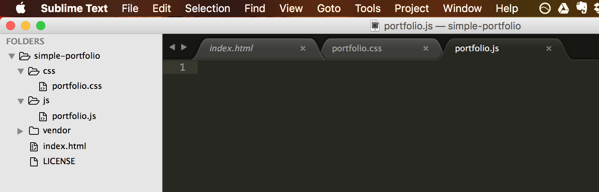

---
title: "Intro to JavaScript"
slug: js-intro
---     

#What is JavaScript?
JavaScript is a programming language used to make web pages interactive. It runs on an interpreter in the browser of your visitor's computer. JavaScript support is built into all the major web browsers, including Internet Explorer, Firefox, Safari and Chrome. Provided that the visitors to your site are using web browsers that support JavaScript ([most do](http://w3techs.com/technologies/details/cp-javascript/all/all)) and have JavaScript enabled (it is by default), then your JavaScript will run when they visit the page.

JavaScript is an interpreted language, as opposed to a compiled one. Your site's JavaScript source is sent to to everyone visiting your site, in plain-text. So you don't need any particular software, like an IDE, to write JavaScript. Any old text editor, like Notepad, TextEdit is quite satisfactory to write JavaScript. That said, an editor like Sublime or Atom that applies syntax highlighting to the code makes it easier to see what is what and makes it easier to find your mistakes.

> [info]
> **Are JavaScript and Java related?**
>
>  
> 
> No, they are two completely different computer languages. Only their names are similar. There's a [wonderful answer on StackOverflow](http://stackoverflow.com/questions/245062/whats-the-difference-between-javascript-and-java) to explain it. 
> 
> *Comic image from [http://www.smashingmagazine.com/2009/07/misunderstanding-markup-xhtml-2-comic-strip/](http://www.smashingmagazine.com/2009/07/misunderstanding-markup-xhtml-2-comic-strip/)*

##Details of the language
JavaScript is case-sensitive and uses the Unicode character set.

In JavaScript, instructions are called statements and are separated by a semicolon (`;`). Spaces, tabs and newline characters are called whitespace. The source text of JavaScript scripts gets scanned from left to right and is converted into a sequence of input elements which are either tokens, control characters, line terminators, comments or whitespace. [ECMAScript](https://en.wikipedia.org/wiki/ECMAScript), the base set of specifications for JavaScript, also defines certain keywords and literals and has rules for automatic insertion of semicolons (ASI) to end statements. However, it is recommended to always add semicolons to end your statements; it will avoid side effects.

More information about JavaScript can be found on [MDN](https://developer.mozilla.org/en-US/docs/Web/JavaScript/Guide/Grammar_and_types), which will explain declarations, variables, data types and literals.

#What is jQuery?
Best described by the [website](https://jquery.com/) itself: *jQuery is a fast, small, and feature-rich JavaScript library. It makes things like HTML document traversal and manipulation, event handling, animation, and Ajax much simpler with an easy-to-use API that works across a multitude of browsers.* 

jQuery is a library written in JavaScript that makes developing in JavaScript easier and has thus become a very popular library.

> [info]
> **jQuery or vanilla JS?**
> 
> There was a time when not all browsers were equal... a nifty "little" library called jQuery came along and attempted to deal with all the inconsistencies by taking over having to deal with the different ways features were supported. Instead of the developer trying to work out how different features in JavaScript would have to be implemented in Internet Explorer and Firefox and Chrome and Opera and and ..., the library knew how to deal with the inconsistencies and the developer could just go ahead and code their great features.
> 
> But then JavaScript evolved. It gained better support in browsers and inconsistencies began to disappear. People wondered if it was still necessary to use jQuery as many things could now be done natively in JavaScript. The advocates of vanilla JS like the idea of reducing the dependency of a library in favor of implementing things in pure JavaScript. However, there are still many things that jQuery can help with and it is still a widely used library, but it isn't as vital as it once was. Especially for smaller projects that do simple things like selecting elements to do something with them, it now seems overkill to use jQuery.  
>
> For our portfolio, we will use jQuery to show you how it is used, but will also offer you a comparison in vanilla JS, so that you may see the difference between them.
>
> An example of selecting an HTML element by id: 
> 
> jQuery:
> `$('#my_id')`
> 
> Vanilla JS:
> `document.getElementById('my_id')`
> 
> Although vanilla JS has more characters in this instance (at least at first glance), it doesn't have the overhead of having to load in an entire library!

#Add JavaScript and jQuery to your page
Just like the CSS can be directly declared in the head tag of the HTML document, JavaScript scripts can be written in a similar fashion within the script tag. However, just as with CSS, best practice is that the JavaScript should be in a separate file and be linked to the HTML in the head tag.

The old way to do this is the same as what we did with our CSS files. You add the `link` tag inside the `head` tag and it loads in the JavaScript file. 

An example of this:

```
    <head>
        <title>Make School's Portfolio</title>
        <link rel="stylesheet" type="text/css" href="./css/portfolio.css">
        <script src="./js/portfolio.js"></script>
    </head>
``` 

Currently, there is some debate as to the best way to link JavaScript source. The browser renders a web page from top to bottom, so in the above example, it will start with loading the CSS file, then load the JavaScript file and then it will render the rest of the HTML content. The problem is that if it takes a long time to load the JavaScript, then the rest of the page will not render until the JavaScript has finished loading. Remember that your visitors might not wait around until the page is loaded; they may go elsewhere. 

Most of the time you don't need the JavaScript as soon as the page is loaded because most of your content will likely be written in HTML. So why load the JavaScript in before the HTML? If you've had a look at the [HTML5 Boilerplate](https://html5boilerplate.com/), you will see that the latest best practice is to load the JavaScript inside the body tag, just before it closes. This ensures that the HTML can render and your visitor sees something happening before the browser starts loading in the JavaScript.

> [action]
> Add a folder to your project and name it **js**. Create an empty file called **portfolio.js** inside the js folder. Create another folder inside the js directory and name it **vendor**.   



We also need to download the jQuery library from the website. As we have already used CSS3, and we are not worried about IE8, we can download the latest 2.x version.

> [action]
> Go ahead and download the compressed production version for our project from the [jQuery website](https://jquery.com/download/). Move it into the newly created vendor folder. It's good practice to keep the JavaScript files you wrote separate from any libraries you might use. 

Now let's add our script tags to the page.

> [action]
> Add the `script` tag for our portfolio.js file and the jQuery library inside the `body` tag just before it closes. Add the jQuery library first, then our own file.

<!-- Comment to break actionable boxes. -->

> [solution]
> The HTML should look like this:
> 
>```
>            ...
>
>                <div class="button">Download My CV</div>
>            </footer>
>            
>            <script src="./js/vendor/jquery-2.2.0.min.js"></script>
>            <script src="./js/portfolio.js"></script>
>        </body>
>    </html>
> ```
> The jQuery library needs to be loaded first because we are going to use jQuery in the portfolio.js file, so need to ensure it's loaded before we try to access it.

#Alert "Hello World"
Now that the files are connected, let's test that we didn't make any mistakes. We are going to use the jQuery **ready** function.

> [action]
> Add the following JavaScript into your portfolio.js file:
> 
> ```
>    $( document ).ready(function() {
>      alert('hello');
>    });
> ```

When you reload the browser, you should see an alert window popping up. If you click "ok", it will close. 


**What is happening here?** We are accessing jQuery with the `$` symbol. The dollar is an alias for jQuery and allows us to access functions that were declared in the library. In this case, the `ready` function. The ready function takes a callback as a parameter. That callback is a function (that we write) that will be called when the ready function is executed, and the ready function is executed by jQuery as soon as the page is fully loaded. In this example, we used the `alert` function, which creates a little popup with the string we pass to it.

The ready function is a good place to put any event listeners for buttons or events that are user triggered.

> [info]
> **Alert in vanilla JS**
> 
> Just for comparison, the above function would look like this in vanilla JS:
> 
> ```
>    document.onreadystatechange = function () {
>        if (document.readyState == "complete") {
>            alert('hello');
>        }
>    }
> ```
> Instead of using the dollar symbol to access the document element, we will use the JavaScript `document` selector and then call a function called `onreadystatechange`. Once the page load is complete (which we check in the `if` statement), we call the `alert` function. This is a simplified version of the jQuery `ready` function, but should demonstrate how different it is to code in vanilla JS as opposed to using the jQuery library.

<!-- Comment to break actionable boxes. -->

> [info]
> **What are event listeners?**
> 
> An event listener is attached to an object, like a button, and waits for some action to be performed on the object. An action could be a mouse click, mouse hover, key press, etc. Once an event has occurred, it is then handled by a function, which does something based on the event. For example, a user presses a button and the function triggered calls the alert function, which displays a message to the user.

Now that we know how to add JavaScript to the page, lets get started by adding a gallery to the website that will showcase the work using the PhotoSwipe plugin. 
