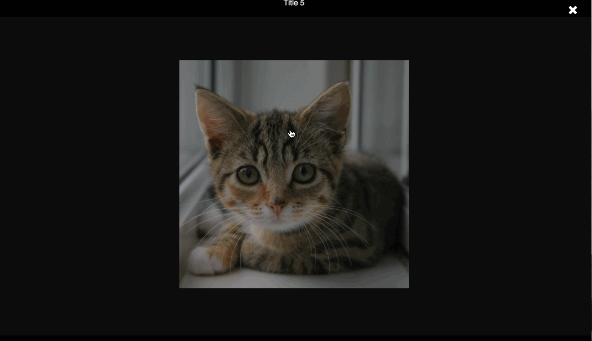
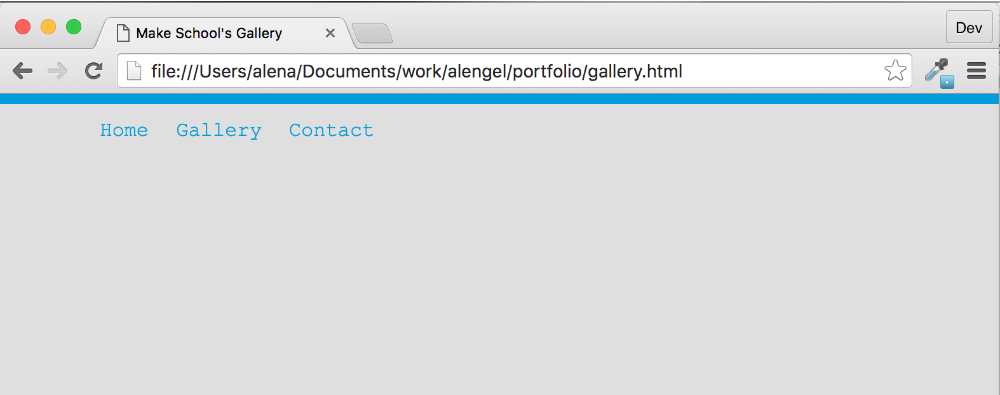
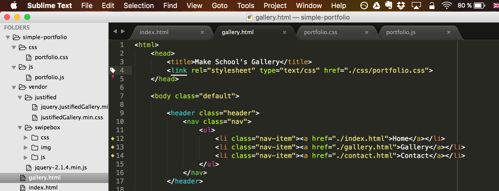
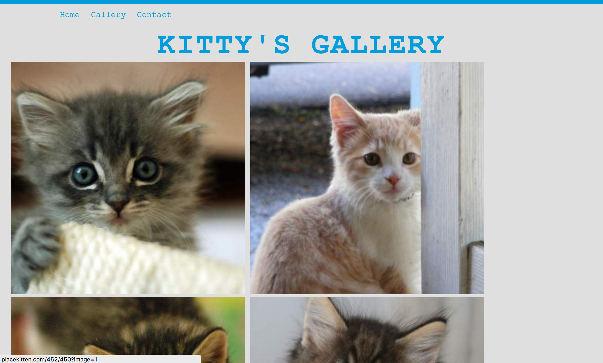
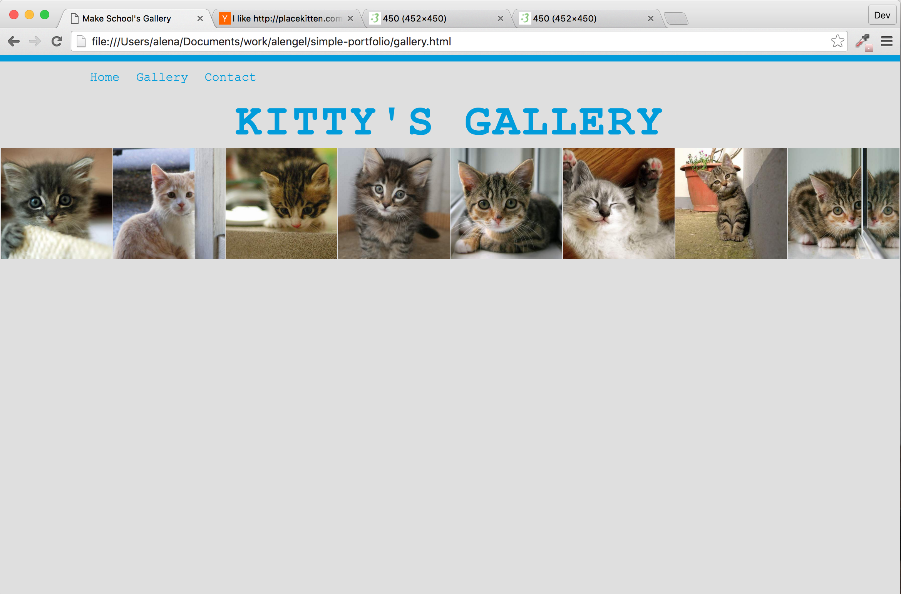
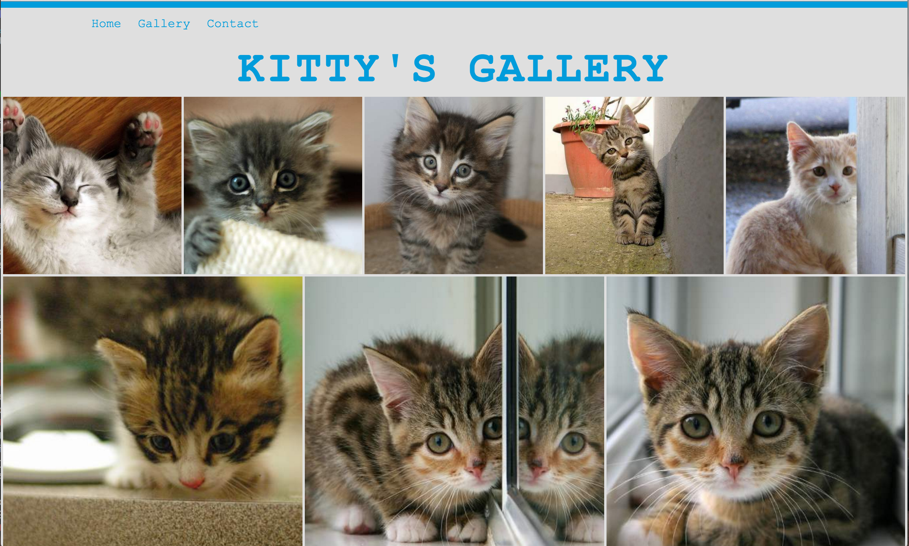

---
title: "Adding a Gallery"
slug: js-gallery
---     

#The Gallery
Once we're done we'll have a page like the one below, that is resizable and allows the visitor to see all your work at once via the thumbnails but also allows them to click on each image to see a bigger image.



#Creating the HTML gallery page
Before we dive in to using the jQuery plugins, we need to create an empty HTML page that will contain the library. We want to make the page look consistent with our first page, so let's reuse some of the styles and add the same header to our gallery page.

> [action]
> Create a new HTML page called gallery.html. Add to it the content of the HTML page from our index.html page but remove everything except the header and the script tags. You can change the content of the title tag to "your_name Gallery".
> 
> Remove the script tags from index.html as we don't need them here anymore.

Your page should now look like this:



> [solution]
> 
> ```
>    <html>
>        <head>
>            <title>Make School's Gallery</title>
>            <link rel="stylesheet" type="text/css" href="./css/portfolio.css">
>        </head>
>    
>        <body class="default">            
>            
>            <header class="header">
>                <nav class="nav">
>                    <ul>
>                        <li class="nav-item"><a href="./index.html">Home</a></li>
>                        <li class="nav-item"><a href="./gallery.html">Gallery</a></li>
>                        <li class="nav-item"><a href="./contact.html">Contact</a></li>
>                    </ul>
>                </nav>
>            </header>
>    
>            <script src="./js/vendor/jquery-2.1.4.min.js"></script>
>            <script src="./js/portfolio.js"></script>
>        </body>
>    </html>
> ```

#Downloading a plugin
Now that we have our empty gallery page, let's download a couple of plugins, the JustifyGallery and the Swipebox libraries. A plugin is an extension of an existing software, in this case the jQuery library.

The instructions for how to use both libraries are well explained, so let's follow them. The libraries have a bit more content when you download them than the jQuery library. Apart from the JS file, they also have a CSS file and images. 

> [action]
> Go to [JustifyGalllery](http://miromannino.github.io/Justified-Gallery/) and download the latest release. Unzip the folder and move the whole folder "as is" into the vendor folder. 
> 
> Now go to [Swipebox](http://brutaldesign.github.io/swipebox/#download) and download the library. Unzip it as well and navigate to **src** folder. Copy that folder into the vendor folder as well. Look at the **css** and **js** folder. There are two files in each, one is the minified version and the other one is the version for development. We don't need both for production, so go ahead and delete the unminified version. The minified version is harder to read because it removes all whitespace to reduce the file size.



Now that we have the two plugins in our project, let's connect them to our HTML file. 

> [action] 
> Add the CSS files inside the head tag. Add the JS files below the jQuery script but above the portfolio.js script. 

<!-- Comment to break actionable boxes. -->

> [solution]
> You should have 3 CSS files inside the head tag and 4 JS files just before the body tag closes.
> 
> ```
>    <html>
>      <head>
>          <title>Make School's Gallery</title>
>          <link rel="stylesheet" type="text/css" href="./vendor/justified/justifiedGallery.min.css" /> 
>          <link rel="stylesheet" type="text/css" href="./vendor/swipebox/css/swipebox.min.css" /> 
>          <link rel="stylesheet" type="text/css" href="./css/portfolio.css">
>      </head>
>    
>      <body class="default">            
>          
>          <header class="header">
>              ...
>          </header>
>    
>          <script src="./vendor/jquery-2.1.4.min.js"></script>
>          <script src="./vendor/justified/jquery.justifiedGallery.min.js"></script>
>          <script src="./vendor/swipebox/js/jquery.swipebox.min.js"></script>
>          <script src="./js/portfolio.js"></script>
>      </body>
>    </html>
> ```

#Adding the gallery HTML
Now that the files are connected, we need to add some HTML first, so the library can take the images and arrange them in a nice grid. 

> [action]
> Add a new section tag after the header tag with the class *gallery-container*. Inside of it, we should add a *h2* tag to properly announce our gallery. We named ours "Kitty's Gallery". What will you name yours? 
> 
> Inside the section tag, we will add a div with the class *gallery*. Inside of it, we will add a bunch of *a* tags. Each a tag will contain an *img* tag that will contain a thumbnail of the image we want to show. These requirements are determined by the library and well documented [here](http://miromannino.github.io/Justified-Gallery/getting-started/).
>
> Add a title attribute to the a tag and an alt attribute to the *img* tag. The *href* attribute for the a tag needs to link to the image you want to display and the *src* attribute of the *img* tag needs to link to the same image or a smaller version of the image (a thumbnail).
> 
> Example snippet:
> 
> ```
>    <a title="your_title" href="your_image_url">
>        
>    </a>
> ```



> [solution]
> 
> ```
>    <section class="gallery-container">
>      <h2 class="sub title">Kitty's Gallery</h2>
>    
>      <div id="gallery">
>          <a title="Title 1" href="http://placekitten.com/452/450?image=1">
>              
>          </a>
>          <a title="Title 2" href="http://placekitten.com/452/450?image=4">
>              
>          </a>
>          <a title="Title 3" href="http://placekitten.com/452/450?image=6">
>              
>          </a>
>          <a title="Title 4" href="http://placekitten.com/452/450?image=9">
>              
>          </a>
>          <a title="Title 5" href="http://placekitten.com/452/450?image=12">
>              
>          </a>
>          <a title="Title 6" href="http://placekitten.com/452/450?image=15">
>              
>          </a>
>          <a title="Title 7" href="http://placekitten.com/452/450?image=13">
>              
>          </a>
>          <a title="Title 8" href="http://placekitten.com/452/450?image=14">
>              
>          </a>
>      </div>
>    </section>
> ```

Now that we have the HTML part of the gallery up, you should see the images in their original sizes. Instead of filling the page nicely, it shows the expanded images and has a lot of white space. Let's take care of that with some simple JavaScript.

#Adding JavaScript to the mix
You will be surprised how little JavaScript we will need to make the gallery look as elegant as in the gif above. All with the help of our plugins. Let's add the magic in our portfolio.js file. 

> [action]
> Remove the alert function from the jQuery ready function if you haven't already, so you have the function ready to fill with the code we need to call our two plugins. We need to call the justifiedGallery function on the parent element that holds all of our images. We already gave it the id gallery, so I'm sure you know which element it is. Use jQuery to select the DOM element with the id *gallery*. Then call the **justifiedGallery** function on it to initialize the plugin. 
> 
> It's a simple as: `$('#my_element').justifiedGallery();`

If you reload the page now, it should look like this:



Now that is lots better of course but the pictures are still not very nicely distributed. All images are in a row and visible but we want our work presented in bigger thumbnails and fill up the whitespace. This is where parameters come in. The library supports a number of parameters, which we can make use of. You can find all of them [here](http://miromannino.github.io/Justified-Gallery/options-and-events/).

We want our rows to have a certain height, so we will use the rowHeight option. We also want a bigger margin between the images and randomize the images each time they load, so that the gallery is never the same layout. There's also the option to justify the last row. This means that all images on the last row will take up the available space as opposed to have them align to the left. This will be nice to get a grid like layout. 

> [action]
> Look at the options available and try to figure out what parameters you need to pass into the function to achieve the above. Parameters get passed into the function inside of curly brackets in a JSON-like format.

<!-- Comment to break actionable boxes. -->

> [solution] 
> We made each row 200 pixels high except the last row which is now justified. We also added a margin of 3 pixels around all the images for a bit of spacing. Making your gallery display the images randomly is totally up to you but we liked it, so we added that parameter.
> 
> ```
>    $( document ).ready(function() {
>      $("#gallery").justifiedGallery({
>        rowHeight : 200,
>        lastRow : 'justify',
>        margins : 3,
>        randomize: true
>      });
>    });
> ```



Excellent! See how easy it is to make use of a plugin? We're almost there now. We're missing only one thing. We you click on an image, the image will open up in a new page but we want our image to "pop up" and display a bigger image on the same page, so our visitors can take a closer look at our work without losing their place.

#Initializing the Swipebox plugin
We want to give users the option to click on the image and then having a bigger "pop up". The Swipebox plugin gives us just that functionality and works very well with the JustifiedGallery plugin. Looking at the documentation for the JustifiedGallery plugin, there is even an [example](http://miromannino.github.io/Justified-Gallery/lightboxes/) on how to achieve this but we'll also explain it here. 

We need to be sure that all photos from the JustifiedGallery have loaded before we call the Swipebox plugin. Luckily for us, the JustifiedGallery provides events that trigger at certain times of the life cycle of the plugin. One of these events is the **jg.complete** event. When it is triggered, it is the perfect time to initialize the Swipebox plugin.

An example of using an event is here:

```
    $('#my_gallery').justifiedGallery({
      our_params: 'are here'
    }).on('jg.complete', function () {
          alert('the gallery is complete');
      });
```

> [action]
> Initialize the Swipebox plugin by replacing the alert function with the **swipebox** function. You need to first select the *a* tag that is around an image with the selector `$('#gallery a')` and then use the function on it just as we did with the justifiedGallery function. The Swipebox library also accepts parameters to do various things, you can see the [docs here](http://brutaldesign.github.io/swipebox/#options). 


> [solution]
> We thought the controls of Swipebox were disappearing too quickly because the default setting is 3 seconds (3000 milliseconds), and instead passed false to **hideBarsDelay** as we don't want the controls to disappear at all. 
> 
> ```
>    $( document ).ready(function() {
>      $("#gallery").justifiedGallery({
>        rowHeight : 200,
>        lastRow : 'justify',
>        margins : 3,
>        randomize: true
>      }).on('jg.complete', function () {
>          $('#gallery a').swipebox({
>            hideBarsDelay : false
>          });
>      });
>    });
`
> ```

And there you have it, a beautiful modern gallery to showcase your work! This is where any potential employers might come to see what you have done so far. But how are they going to contact you if they liked your work? Well that is the question we answer in the next part when we build a "Contact Me" form.
