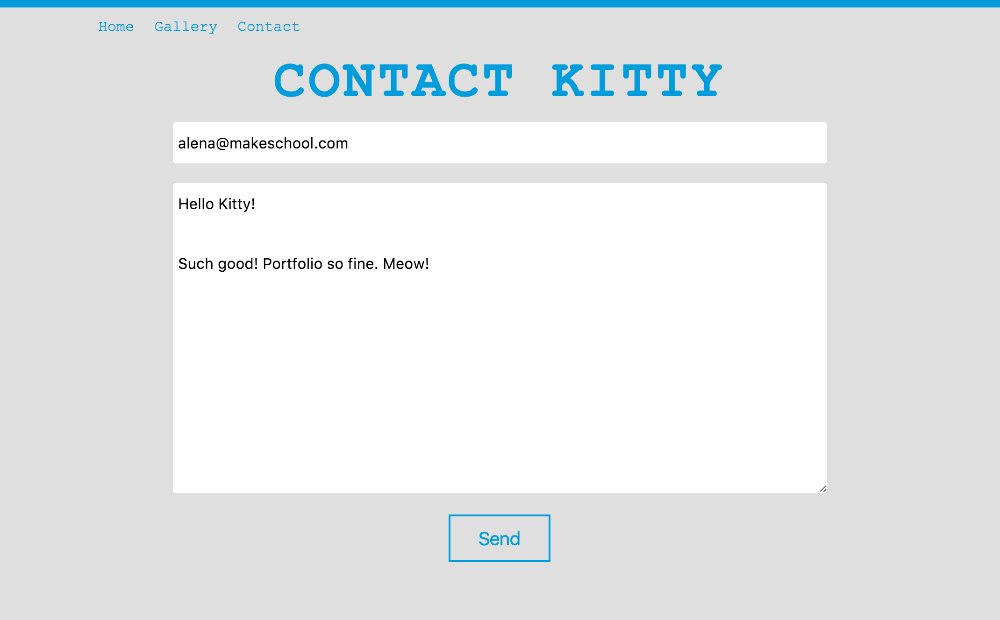
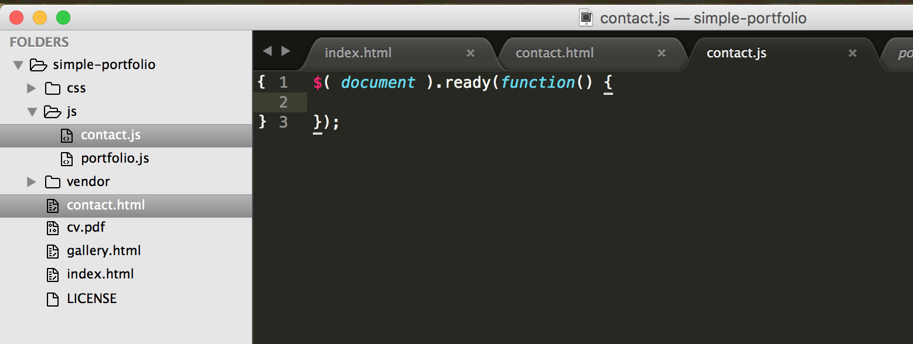
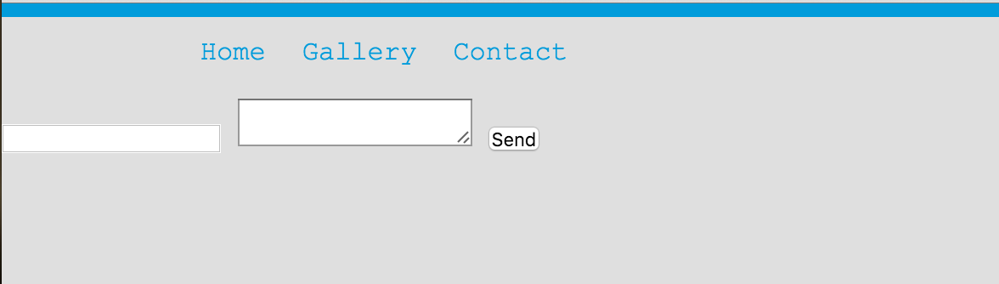
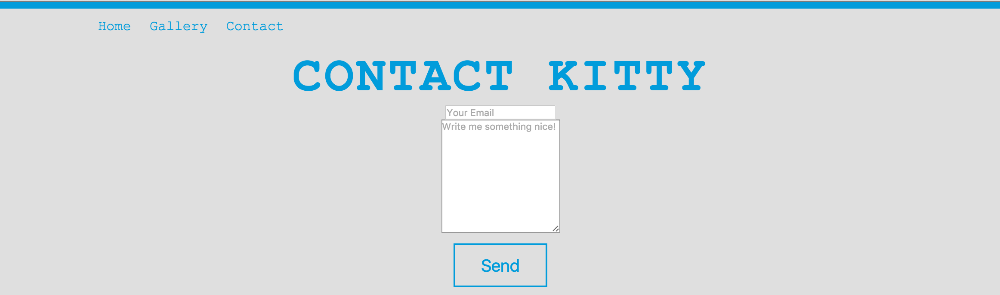
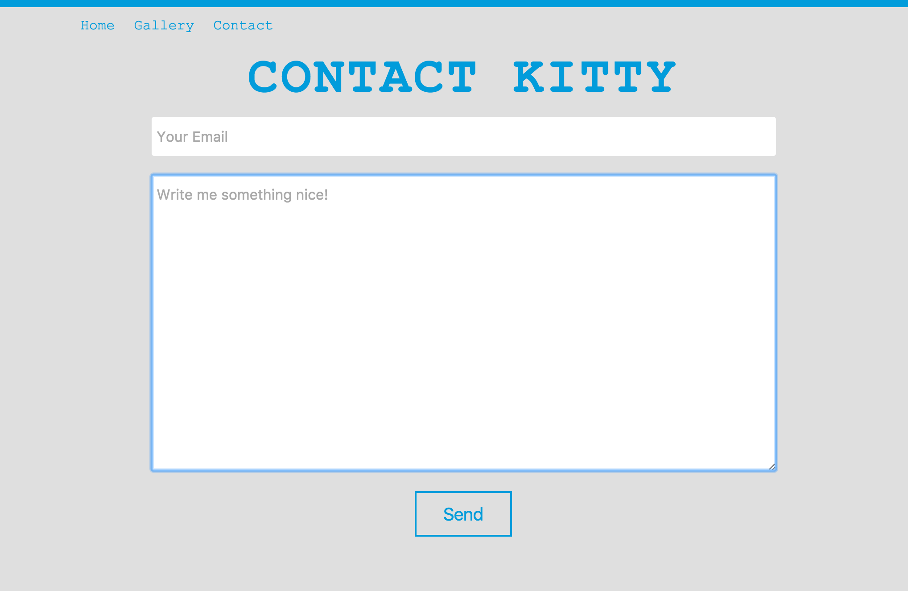

---
title: "Contact Me Form"
slug: contact-me
---     

#A Contact Me form
You've seen them everywhere: most websites have a page that will allow visitors to get in touch with the owners of the page. It might be to ask a question of interest, or it might be because they're looking to hire you! In any case, we need to give our visitors a way to get in touch. 
Of course, we could just add our email address to the page, but that gives spam bots an easy way to fill our inboxes with rather interesting stuff.

We will make a Contact Me form like the one below:



#Creating the empty Contact Me page
Like before with the gallery page, we will repeat the process of creating a new HTML file. Let's also make a new JS file.

> [action]
> Create a new HTML file named **contact.html** in the root directory and copy and paste the HTML content from the gallery page into your new file. You probably guessed it already, delete all of the content inside the `<body>` except the content inside the `<header>` tag.
> 
> Change the `<title>` to something appropriate.  Remove the JustifiedGallery and Swipebox CSS.
> 
> Create a new JS file in the **js** folder and name it **contact.js**. Put an empty jQuery **ready** function into your new JS file.  Make sure that jQuery and contact.js are linked to your HTML. Put them in the usual place, just before the closing `body` tag.



> [solution]
> The HTML file:
> 
> ```
>    <html>
>        <head>
>            <title>Contact Me</title>
>            <link rel="stylesheet" type="text/css" href="./css/portfolio.css">
>        </head>
>    
>        <body>            
>            
>            <header class="header">
>                <nav class="nav">
>                    <ul>
>                        <li class="nav-item"><a href="./index.html">Home</a></li>
>                        <li class="nav-item"><a href="./gallery.html">Gallery</a></li>
>                        <li class="nav-item"><a href="./contact.html">Contact</a></li>
>                    </ul>
>                </nav>
>            </header>
>            
>            <script src="./vendor/jquery-2.2.0.min.js"></script>
>            <script src="./js/contact.js"></script>
>    
>        </body>
>    </html>
> ```
> 
> And our empty JS file:
> 
> ```
>    $( document ).ready(function() {
>      
>    });
> ```

Now we are ready to begin in earnest. Let's add some form elements to our page.

#Form elements
HTML has special elements for forms, called input elements. The most prominent are:

- `form` - which wraps the form. All data inside the form will be submitted.
- `input` - this element can be a checkbox, radio button or text field depending on the `type` that is specified (like this in HTML: `type="text"`). Note that `input` has no closing tag. Popular [types](https://developer.mozilla.org/en-US/docs/Web/HTML/Element/input) are:
    - `checkbox` - makes a checkbox
    - `radio` - makes a radio button
    - `text` - makes a text field on a single line
    - `email` - validates the input to be a valid email
    - `date` - makes a date picker to select a date
    - `url` - validates the field for a URL
    - `password` - obscures the input value
- `textarea` - A special kind of text field that can expand to multiple lines, great for longer-form responses
- `button` - used with the `type="submit"` will submit the form data to the URL you specify.

Those elements are enough to get us started as we will have a simple form. We will give the user a field to enter their email and another to enter their request. Below the form we will add a button to submit the form.

> [action]
> Inside the `<body>` and below the `<header>`, add a `<section>` and inside of it create a form with an email field and a `textarea`. Add a `<h2>` title to your form inside the section tag but above the form tag.



> [solution]
> The HTML in its simplest form:
> 
> ```
>    <section>
>        <h2>Contact Kitty</h2>
>        <form>
>            <input type="email" />
>            <textarea></textarea>
>            <button type="submit">Send</button>
>        </form>
>    </section>
> ```

The form is not very pretty yet but we will make it look better soon. Before we move on to styling the form, let's add placeholders and make the `textarea` a bit bigger. The `placeholder` attribute can be added to any `input` or `textarea` tag that has a text field. It looks like this: `placeholder="Put something meaningful here"` as an attribute to the tag. The `textarea` tag also accepts attributes `rows` and `cols`, which control how many rows and columns should be shown by default. We can also make use of the `required` attribute. It takes no value but when added to an input element, the browser will validate that the input element has a value and is not empty.


> [action]
> Add a `placeholder` to the email `<input>` and the `<textarea>`. Add `cols` and `rows` to the `textarea` tag and play around with the numbers. Start with 5 for each and see what that does. You will probably want to increase those numbers. Make both the email `input` and `textarea` `required`.
> 
<!-- Comment to break actionable boxes. -->

> [solution]
> 
> ```
>    <input type="email" placeholder="Your Email" required />
>    <textarea rows="10" cols="20" placeholder="Write me something nice!" required></textarea>
> ```

#Styling the form
One thing that is very easy to fix, and we already have classes for, is the order of the form. Instead of having everything in a row, we want the form to be in a column. Any idea which classes I mean? Yes, `flex` of course!

> [action]
> Add the `flex` and `column` class to the form. We also already have classes for the title: add `title` and `sub` to the `h2` tag. The title won't be centered, but we want it to be, so fix that by adding `text-align: center` as a rule to the `title` class.

With those small additions the form is better looking, but there are still some issues remaining.

> [action]
> Add the `button` class to the button. Reload the page.

When you have added the `button` class, you will see that the `button` is a darker gray instead of the color of the background. That is because the default color of a `button` is that dark gray. We need to change it by updating the `button` class in the CSS with the background color *transparent*. 

> [action]
> Add the property `background-color` with the value `transparent` to the `button` class. 



> [solution]
> Your HTML should look like this:
> 
> ```
>    <section>
>        <h2 class="sub title">Contact Kitty</h2>
>        <form class="flex column">
>            <input type="email" placeholder="Your Email" required />
>            <textarea rows="10" cols="20" placeholder="Write me something nice!" required></textarea>
>            <button class="button" type="submit">Send</button>
>        </form>
>    </section>
> ```

Let's remove the squashiness of the form by adding some margin and padding to the elements. We can also use the `border-radius` property to make the input elements less edgy.

> [action]
> 
> Add a class to the `input` and `textarea` elements. Play with the following properties in the inspector to see what they do and what values they offer:
> 
> - `width` - sets the width of the element, best set in percentage, so it resizes dynamically with the page
> - `max-width` - sets the maximum width of an element, great to prevent elements to become too big on bigger displays
> - `margin` - the area between elements in the box model
> - `line-height` - controls the height of text, use the value **em** instead of **px**
> - `padding` - the area between the border and the content in the box model
> - `font-size` - use **em** here too
> - `border-radius` - try a small pixel value and see what this does to the edges to your input elements
> - `border` - you can set a border with the shorthand `1px sold black` or you can remove the border completely with the value `none`

<!-- Comment to break actionable boxes. -->

> [info]
> **What is the difference between px, em and % ?**
> 
> There is an [excellent post on CSS Tricks](https://css-tricks.com/css-font-size/), which breaks down the difference and gives good examples as to what they look like. 



> [solution]
> The above form was created with the properties in the list above and the following values in the CSS:
> 
> ```
>    .input-field {
>      width: 80%;
>      max-width: 700px;
>      margin: 1%;
>      line-height: 2em;
>      padding: 6px;
>      font-size: 1em;
>      border-radius: 3px;
>      border: none;
>    }
> ```

Now that we have a beautiful form, let's connect it to a service, so visitors can send you an email. 
